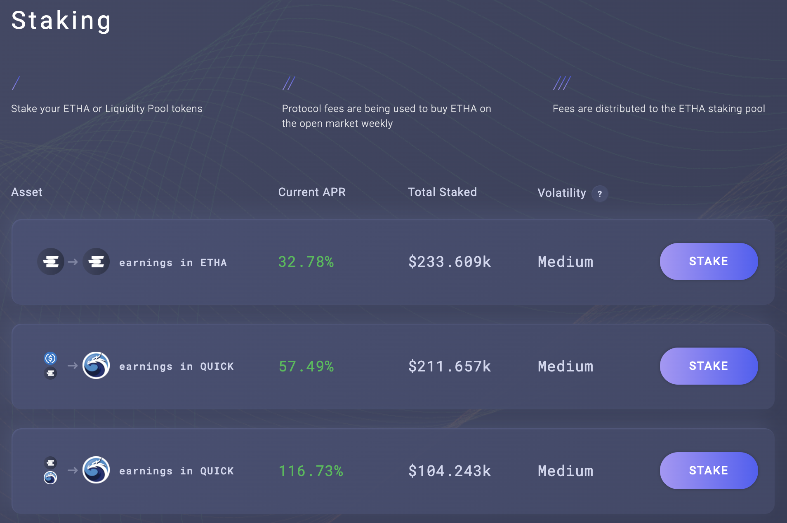

# MAI Staking auf Ethalend

## Einleitung

<<<<<<< HEAD
Eine der Aufgaben dieser Website und der Sammlung von Tutorials ist es, DeFi benutzerfreundlich zu machen, indem wir die komplexesten Protokolle entmystifizieren. Diese Vision wird auch vom Team hinter [Ethalend](https://www.ethalend.org) geteilt, und dieser Leitfaden zeigt dir, wie du diese Plattform in Verbindung mit Mai Finance nutzen kannst, um deine stabilen Erträge beim Farmen zu steigern.
=======
One of the missions of this website and the collection of tutorials that are offered is to make DeFi user friendly by demystifying the most complex protocols. This vision is also shared by the team behind [Ethalend](https://www.ethalend.org/), and this guide will present a perfect way to use this platform in conjunction with Mai Finance to amplify your stable farming yields.
>>>>>>> dd7bf1b (GitBook: [#262] Optimism + Arbi + BNB + Moonbeam)

## Ethalend Vorstellung

### Was ist Ethalend

<<<<<<< HEAD
Ethalend ist ein zusammensetzbares Protokoll, das die Komplexität in DeFi abstrahiert, um algorithmisch optimale Erträge zu erzielen. Es ist kein Renditeaggregator, sondern ein Renditeoptimierer. Du kannst dein Vermögen auf der Plattform deponieren und der Algorithmus, der für den Pool zuständig ist, in dem du dein Vermögen deponierst, investiert es auf die bestmögliche Weise. Die Renditen werden dann in dem Ethalend-eigenen Token, dem ETHA-Token, sowie in einigen Partner-Token ausgeschüttet, darunter Qi von Mai Finance, den du durch Einzahlung deines MAI in den MAI-USDT eVault erhältst. Mehr über Ethalend erfährst du in der [offiziellen Dokumentation](https://docs.ethalend.org) oder in diesem hervorragenden [Interview mit dem Mitbegründer](https://ambcrypto.com/un-complicating-defi-an-interview-with-ethalend-co-founder-danny-b/).
=======
Ethalend is a composable protocol that abstracts the complexity in DeFi to provide algorithmically optimal yield. It is not a yield aggregagor, but a yield optimizer. You will be able to deposit your assets on the platform, and the algorithm in charge of the pool in which you deposit your assets will actually invest them in the best way possible. Yields are then distributed in the native token of Ethalend, the ETHA token, as well as some partner tokens, including Qi from Mai Finance that you can get by depositing your MAI in the MAI-USDT eVault. You can read more about Ethalend via their [official documentation](https://docs.ethalend.org/), or by reading this excellent [interview of the co-founder](https://ambcrypto.com/un-complicating-defi-an-interview-with-ethalend-co-founder-danny-b/).
>>>>>>> dd7bf1b (GitBook: [#262] Optimism + Arbi + BNB + Moonbeam)

### Erstelle dir ein Ethalend wallet von deinem web3 wallet

Das Interessante an Ethalend ist, dass die Anwendung eine eigene On-Chain-Wallet verwendet, die nicht mit deiner Web3-Wallet verbunden ist. Das kann als Vorteil betrachtet werden

* Ein Vorteil ist, dass das Vertragsrisiko auf das beschränkt ist, was in dieser privaten Wallet enthalten ist. Außerdem sind einige Interaktionen zwischen der Ethalend-Anwendung und der privaten Wallet direkt in die Nutzung der Plattform integriert, wodurch du einige Transaktionsgebühren sparen kannst. Übrigens ist die ETHA Smart Wallet nicht verpfändet, d.h. nur du hast Zugriff auf die Wallet, es ist nicht wie bei einer zentralisierten Master Wallet, die den Anteil deiner Wallet kontrolliert.
* Nachteilig ist, dass die ETHA Smart Wallet nicht mit physischen Geräten kompatibel ist, was deine Routine komplizierter macht.

Es liegt an dir, zu entscheiden, ob die Vorteile die Nachteile aufwiegen. Wenn du bereit bist, deine Wallet zu erstellen, klicke einfach auf die Schaltfläche "Wallet erstellen" in der oberen rechten Ecke deines Bildschirms.

## Strategie Übersicht

Diese Strategie kann zu deinem Topf mit relativ sicheren Strategien hinzugefügt werden, da sie das Farmen von Stable Coins als Grundlage nutzt und dank der Belohnungen der stabilen Position zusätzliche Renditen liefert.

### MAI staking and Gewinne

Einer der großen Vorteile von Ethalend und eines der Hauptmerkmale, das die DeFi-Vereinfachung ermöglicht, ist, dass du kein LP-Paar (Liquidity Providing) bereitstellen musst, das aus zwei Vermögenswerten mit einer Ratio von 1:1 besteht. Der Algorithmus, der den Pool (oder in unserem Fall eVault) verwaltet, macht das automatisch für dich. Sobald du dein Vermögen in einem eVault deponiert hast, wird es automatisch an das beste Protokoll weitergeleitet, das deine Rendite maximiert. Die Belohnungstoken werden regelmäßig für dich gefarmt und umgewandelt.

Wie du sehen kannst, werden die Details der Belohnungen im rechten Teil des Bildschirms angezeigt. Die ETHA-Belohnungen werden nicht angezeigt, aber du bekommst eine Schätzung der Qi-Belohnungen, die mit deiner Einzahlung verbunden sind. Wenn du auf der Seite nach unten scrollst, bekommst du auch einen guten Überblick über die zugrunde liegende Strategie, die in unserem Fall QuickSwap verwendet. QUICK Belohnungen werden in Qi Belohnungen umgewandelt. ETHA Belohnungen werden durch das Protokoll geprägt, um dir einen Anreiz zu geben, ihre Plattform anstelle von QuickSwap zu nutzen.


Achte auf die 0,10 % Ausstiegsgebühren. Zum jetzigen Zeitpunkt muss ich bei einer Einzahlung von 100 MAI eine Ausstiegsgebühr von 0,1 MAI zahlen, was ungefähr 10 Tagen Farmen im eVault entspricht. Vergewissere dich, dass du diesen Punkt verstanden hast, bevor du etwas investierst.


### Stake ETHA: Ethalend oder QuickSwap

Die Belohnung, die du für das Ausleihen deiner MAI auf Ethalend erhältst, wird in ETHA, dem nativen Token von Ethalend, ausgezahlt. Einer der Hauptvorteile von Ethalend ist, dass du deine ETHA-Token direkt auf der Plattform staken kannst und so deine Rendite vergrößerst.

Wie du siehst, ist die beste Option, die verdienten ETHA in den ETHA-QUICK-Pool einzuzahlen. Aufgrund der Beschaffenheit der beiden Vermögenswerte (sehr volatil) ist die Belohnung sehr hoch. Du kannst die impermanenten Verluste reduzieren, indem du deine ETHA in den ETHA-USDT-Pool einzahlst, wenn du das möchtest. In beiden Fällen wirst du mit QUICK-Tokens belohnt. Und wenn du wirklich auf ETHA stehst, kannst du deine Belohnung im ETHA-Pool für zusätzliche ETHA staken.

Die Vaults zum Staken auf Ethaland sind eine praktische Funktion von Ethalend. Wenn du deine Token in den Pool einzahlst, verkauft der Balancing-Algorithmus ein paar der eingezahlten Token, um die andere Seite des LP-Paares zu kaufen und dieses Paar im QuickSwap zu verwenden. Übrigens kannst du das auch manuell machen: Fordere deine ETHA-Token an, hebe sie in deinem web3 Wallet ab, verkaufe 50% für QUICK-Token, erzeuge einige LP-Token und deponiere sie im QuickSwap-Pool:


QuickSwap wirbt mit einem effektiven Jahreszins von 223,1% für das Paar ETHA-QUICK, während Ethalend einen APR von 116,73% für dasselbe Paar angibt. Das liegt an dem Unterschied zwischen APY (**A**nual **P**ercentage **Y**ield, oder Belohnungen mit Auto-Compounding) und APR (**A**nual **P**ercentage **R**evenue, oder Belohnungen ohne Auto-Compounding). Die beiden Prozentsätze sind genau gleich, es spielt also keine Rolle, auf welcher Plattform du deine ETHA-Tokens einsetzt.


### dQUICK Mai Vault

Die QUICK-Belohnungen, die du durch das Staken deiner ETHA erhältst, kannst du am besten in dQUICK umwandeln. dQUICK kannst du in der Dragon's Lair auf QuickSwap erstellen. Auf diese Weise schafft QuickSwap Anreize für die Nutzer, ihre QUICK zu staken, indem es sie mit zusätzlichen QUICK belohnt: Wenn du deine QUICK-Token auf QuickSwap sperrst, erhältst du zusätzliche Token.


Der dQUICK-APY variiert stark zwischen 20% und 40%, je nachdem, wie viele QUICK-Token tatsächlich auf der Plattform gestaked werden.


Aber das Beste an dQUICK ist, dass es ein "Proof of Deposit"-Token ist, der bei Mai Finance als Sicherheit verwendet werden kann. Das bedeutet, dass du, nachdem du deine QUICK Belohnungen von Ethalend bei QuickSwap eingezahlt und dQUICK erhalten hast, zu Mai Finance gehen und die dQUICK Token in einen dQUICK Vault einzahlen kannst, um MAI dafür zu leihen.

Ein paar Dinge über die dQUICK Vaults:

* Sie haben eine Liquidation Ratio von 130%, was bedeutet, dass du dir eine Menge MAI gegen deine dQUICK-Token leihen kannst. Wenn du jedoch auch Belohnungen für das Ausleihen sammeln willst, musst du ein CDR (**C**Sicherheiten zu **D**Schulden **R**atio) zwischen 155% und 400% einhalten. Das ist eine gute Idee, da der QUICK-Token ziemlich volatil ist, und als allgemeine Regel empfiehlt diese Website eine CRD, die 100% über der Liquidation Ratio liegt (oder 230% für dQUICK).
* dQUICK Vaults gehören zu denjenigen mit dem höchsten APR, wenn du MAI gegen dQUICK leihst. Zurzeit kannst du dir bis zu 39,40% APR in Qi-Token auszahlen lassen, basierend auf der Menge an MAI, die du gegen deine MAI leihen wirst.

Du siehst schon, dass die Bereitstellung von dQUICK sehr interessant ist, da du einen Vermögenswert hast, für den du von QuickSwap Belohnungen erhältst, du Qi-Belohnungen für deinen Kredit bekommst und du MAI münzt, die dann wieder in den eVault auf Ethalend eingezahlt werden können, was deine stabile Position beim Farmen erhöht.

### What du mit den Qi Belohnungen machen kannst&#x20;

Dieses Thema ist in [einem eigenen Artikel ](what-to-do-with-qi-on-polygon.md)erklärt. Für dieses Tutorial werden wir dein Qi einfach in den Qi-BAL-Pool auf Balancer einzahlen, um von einem soliden APR zu profitieren, der in zusätzlichen Qi- und BAL-Token bezahlt wird, die du in genau demselben Pool zusammensetzen kannst.

## Starte das System

Im Folgenden wird eine Simulation mit einer Anfangsinvestition von MAI im Wert von 100 US-Dollar erzeugt, die du entweder aus einem bestehenden Vault leihen oder auf einer DEX-Plattform kaufen kannst. Dabei wird davon ausgegangen, dass alle aktuellen APRs und APYs über den Zeitraum von einem Jahr gleich bleiben und dass alle Token den gleichen Preis haben, was (natürlich) nie der Fall sein wird.

### Tag 1

Am ersten Tag zahlst du deine MAI auf Ethalend in den MAI-USDT-Pool ein und erhältst am Ende des Tages die Belohnung in Qi und ETHA.

| Belohnungstyp       | Wert in Dollar |
| ------------------- | -------------- |
| Mai auf Ethalend    | 100.000        |
| Qi+BAL auf Balancer | 0.032          |
| ETHA auf Ethalend   | 0.070          |
| dQUICK auf Mai      | 0.000          |
| Schulden auf Mai    | 0.000          |

### Tag 2

An Tag 2 kannst du deine ETHA von Tag 1 auf Ethalend staken, wodurch du QUICK Belohnungen erhältst, die du dann auf QuickSwap in dQUICK umwandeln und auf Mai Finance einzahlen kannst, um mit diesen Token MAI zu leihen. Du kannst deine Qi auch in den Balancer-Pool einzahlen. Am Ende von Tag 2 wirst du erhalten:

| Belohnungstyp       | Wert in Dollar |
| ------------------- | -------------- |
| Mai auf Ethalend    | 100.000        |
| Qi+BAL auf Balancer | 0.065          |
| ETHA auf Ethalend   | 0.141          |
| dQUICK auf Mai      | 0.000          |
| Schulden auf Mai    | 0.000          |

Von dort aus wird das System gebootet und du kannst deine stabile MAI-Position ausbauen sowie Belohnungen in Qi, BAL, ETHA und dQUICK erhalten. Da du dir nicht weniger als 0,01 MAI leihen kannst, musst du 14 Tage lang dQUICK ansammeln, bevor du dir MAI leihen kannst.

## Farming Resultate

### Tägliche Routine

Die tägliche Routine beim Farmen besteht aus:

* Qi und ETHA Belohnungen aus dem MAI-USDT Pool auf Ethalend ernten
* Einzahlung der Qi-Token in den Balancer-Pool auf Balancer
* Einzahlung der ETHA-Token in den ETHA-QUICK-Pool auf Ethalend
* Sammle QUICK Belohnungen aus dem ETHA-QUICK Pool auf Ethalend
* Konvertiere QUICK in dQUICK auf QuickSwap
* Einzahlung von dQUICK in den dQUICK Vault auf Mai Finance
* Leihe dir MAI aus dem dQUICK Vault auf Mai Finance
* Zusätzliche geliehene MAI in den MAI-USDT-Pool auf Ethalend einzahlen

Außerdem kannst du die Belohnungen Qi und BAL wöchentlich ernten und zusammensetzen.

### Resultate Monat für Monat

| Tag | Mai auf Ethalend | Qi auf Balancer | ETHA auf Ethalend | dQUICK auf Mai | MAI Schulden |
| --- | ---------------- | --------------- | ----------------- | -------------- | ------------ |
| 30  | 100.046          | 1.015           | 2.186             | 0.099          | 0.049        |
| 60  | 100.196          | 2.116           | 4.303             | 0.406          | 0.203        |
| 90  | 100.453          | 3.315           | 6.424             | 0.926          | 0.463        |
| 120 | 100.819          | 4.624           | 8.553             | 1.666          | 0.833        |
| 150 | 101.297          | 6.058           | 10.690            | 2.631          | 1.315        |
| 180 | 101.892          | 7.632           | 12.838            | 3.828          | 1.914        |
| 210 | 102.606          | 9.361           | 15.001            | 5.263          | 2.632        |
| 240 | 103.443          | 11.264          | 17.179            | 6.945          | 3.473        |
| 270 | 104.406          | 13.360          | 19.377            | 8.881          | 4.441        |
| 300 | 105.501          | 15.671          | 21.597            | 11.079         | 5.540        |
| 330 | 106.731          | 18.220          | 23.841            | 13.548         | 6.774        |
| 360 | 108.100          | 21.032          | 26.113            | 16.297         | 8.149        |
| 365 | 108.343          | 21.528          | 26.495            | 16.783         | 8.392        |

### Tag 365

Am Ende eines Jahres hättest du

* MAI im Wert von $108,34 im MAI-USDT-Pool auf Ethalend
* ETHA im Wert von 26,49 $ im ETHA-QUICK-Pool auf Ethalend
* Qi im Wert von 21,52$ im Qi-BAL-Pool auf Balancher
* dQUICK im Wert von 16,78 $ im dQUICK Vault bei Mai Finance
* MAI-Schulden im Wert von 8,39 $ bei Mai Finance

Das ergibt ein Vermögen von 173,14 $ und eine ausstehende Schuld von 8,39 $, was einem effektiven Jahreszins von 64,757% entspricht. Das entspricht einem effektiven Jahreszins von 64,75 %. Dies wird mit einer Anfangsinvestition von 100 USD in MAI und einem stabilen Pool als Grundlage für das Farmen erreicht. Beachte, dass die Transaktionsgebühren nicht berücksichtigt wurden, aber das Endergebnis beeinflussen können. Außerdem wird angenommen, dass du ein ganzes Jahr lang täglich Zinseszinsen zahlst.

## Haftungsausschluss

Alles, was in diesem Tutorial vorgestellt wird, ist pädagogischer Inhalt, der veranschaulichen soll, wie du deine MAI nutzen kannst, ohne sie zu verkaufen, und trotzdem einen APY von mehr als 60 % erzielen kannst, indem du verschiedene Protokolle wie Legosteine verwendest. Diese Anleitung sollte jedoch nicht als Finanzberatung betrachtet werden.

Außerdem stellt die Strategie hier einen geschlossenen Kreislauf dar, bei dem keine Token verkauft werden und jedes System das nächste füttert. Wie du sehen kannst, ist die dQUICK-Endposition jedoch nicht sehr hoch, und der MAI-Kredit wird wahrscheinlich nicht viel Qi einbringen. Du kannst wahrscheinlich das gleiche Ergebnis (wenn nicht sogar ein besseres) erzielen, wenn du die Belohnungen aus dem ETHA-QUICK-Pool verkaufst, MAI kaufst und es zu deiner MAI-USDT-Position hinzufügst.


Denke daran, dass eine Strategie, die zu einem bestimmten Zeitpunkt gut funktioniert, zu einem anderen Zeitpunkt schlecht abschneiden (oder Geldverluste erzeugen) kann. Bitte bleibe informiert, beobachte die Märkte, behalte deine Investitionen im Auge und recherchiere wie immer selbst.

