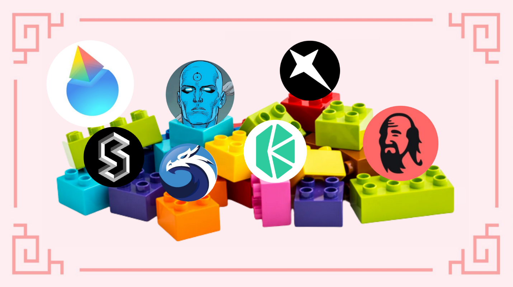
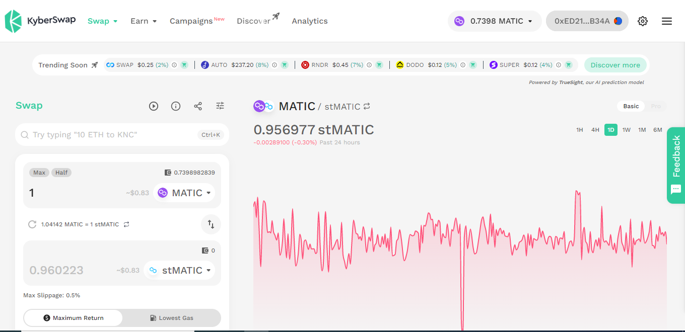
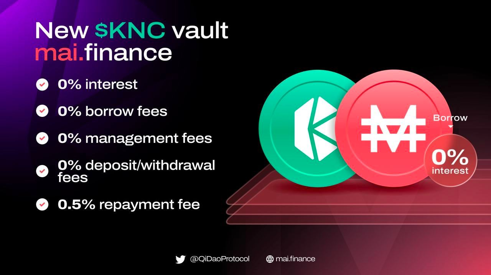

# Guides for Polygon supporters with Qi DAO

<figure><figcaption></figcaption></figure>

## I. Introduction

### Staking and liquid staking tokens

Staking is a term derived from [the Proof of Stake](https://en.wikipedia.org/wiki/Proof\_of\_stake) (PoS) mechanism, which describes the process of locking native cryptoassets as collateral to participate network validation. There are [various staking mechanisms](https://ethereum.org/en/staking/pools/), which are suitable for specific demands and capacities including solo staking, staking as-a-service, exchange staking, and liquid staking. While solo staking and staking-as-service require a significant technical effort and a full amount of staking requirement, for example, Ethereum network requires a minimum amount of 32 ETH or $42,000 (current price) need to be locked to active a validator, liquid staking allows for any deposit amount which then will be pooled together to meet network requirement before delegating it to chosen validators.

<figure><figcaption>
Staking on Polygon Network
</figcaption></figure>

Besides, liquid staking users could exit their staking position anytime by trading their receipt tokens back to their original assets in any DEX in which the liquidity for their tokens is available. In contrast,  solo staking and staking as-a-service are more likely vulnerable with price volatility due to locked assets becoming illiquidity during staking period. Therefore, liquid staking has been recognized as the most popular staking mechanism among investors, especially retail stakers.

Liquid staking tokens are issued by liquid staking protocols for their stakers as receipts which will be burnt after redemption. They are non-rebasable tokens, which means the number of tokens will be constant while their exchange rate with staked assets is increasing followed by a staking reward rate over the staking period. Currently,[ Lido Finance](https://polygon.lido.fi/?pk\_vid=e5bd510b25e807b01665044852e22b7d) has provided **6.3% APR for their MATIC stakers which is slightly higher than** [**Stader**](https://polygon.staderlabs.com/liquid-staking/maticx) **has**. However, liquid MATIC token holders could enjoy a much better return by utilizing their tokens in DeFi platforms, which are considered as alternatives to holding.

### Lido Finance and stMATIC

[Lido Finance](https://lido.fi/) is the biggest liquid staking provider with [over $6 billion](https://defillama.com/protocol/lido) worth of staking assets across multiple chains including Ethereum, Polygon, Polkadot, and Kusama. stMATIC is a receipt token for their MATIC stakers which represents the share of the staker on MATIC staking pool. The token could be acquired by staking your MATIC to staking smart contracts on the [Ethereum mainnet](https://polygon.lido.fi/?pk\_vid=e5bd510b25e807b01665044852e22b7d). It is important to notice that Lido applies a 10% fee on staking rewards which mainly uses for slashing insurance and validator compensation.

<figure><figcaption>
Staking MATIC on Lido Finance
</figcaption></figure>

The token then could be bridged to Polygon network through the [official Polygon PoS bridge](https://wallet.polygon.technology/bridge/) by pasting Ethereum [stMATIC address](https://etherscan.io/token/0x9ee91F9f426fA633d227f7a9b000E28b9dfd8599).

<figure><figcaption>
Bridging stMATIC to Polygon
</figcaption></figure>

However, there is a much simpler way to get stMATIC by swapping directly on DEXes which are Quickswap, Balancer, and [Kyber Network](https://kyberswap.com/swap/polygon/matic-to-stmatic?lng=en-US) on Polygon while still enjoying staking reward.

<figure><figcaption>
Swapping stMATIC on Kyberswap
</figcaption></figure>

### Stader and MATICx

[Stader](https://staderlabs.com/) is also a liquid staking protocol with more than [$150 million worth](https://defillama.com/protocol/stader) of staking assets **** which range from different blockchains. They started their staking solution for Terra Classic at first before expanding their service to other networks. Polygon is their latest supported network with MATICx as their receipt token for their MATIC stakers. Similar to Lido Finance, their MATIC staking contracts are deployed in [Ethereum Mainnet](https://polygon.staderlabs.com/liquid-staking/maticx).&#x20;

<figure><figcaption>
Staking MATICx on Stader
</figcaption></figure>

However, there is a little more convenience compared with Lido, Stader has also implemented the MATIC staking [smart contracts on Polygon ](https://polygon.staderlabs.com/liquid-staking/maticx)for users who might feel comfortable with Polygon transaction fee. The staked MATIC on Polygon then will be eriodically bridged back to the mainnet.

MATICx could also be acquired by exchanging them in [Quickswap](https://quickswap.exchange/#/swap?currency1=0xfa68FB4628DFF1028CFEc22b4162FCcd0d45efb6) as Stader suggested on their staking page for a better rate.&#x20;

<figure><figcaption></figcaption></figure>

### Manhattan Finance and MAI

Liquid tokens including stMATIC and MATICx could be used as collateral assets to borrow other assets in other DeFi protocols such as Manhattan Finance. [Manhattan Finance](https://manhattan.finance/) is a collateralized debt position (CDP) protocol with fixed interest rates. Currently, the protocol has supported [stMATIC and MATICx](https://app.manhattan.finance/vaults/create) as their collateral assets for borrowing stablecoin MAI – the soft-peg stablecoin is created by [QiDao](https://www.mai.finance/) protocol with the same 1% interest rate.

<figure><figcaption>
Vaults on Manhattan Finance
</figcaption></figure>

### Arrakis Finance and MATICx –MAI LP

[Arrakis Finance](https://www.arrakis.finance/) is an automatic liquidity management protocol built on Uniswap V3 by creating a curated marketplace of tokenized LP strategies. Qi Dao has recently launched[ MATICx-MAI](https://app.mai.finance/farm) farming vault on Arrakis Finance with up to **40% APR** which is incentivized in form of SD token – the Stader native token.

<figure><figcaption>
MATICx-MAI pool on Mai Finance
</figcaption></figure>

### Kyberswap and stMATIC-MAI LP

[KyberSwap](https://kyberswap.com/about/kyberswap) is a leading decentralized exchange aggregator in multiple chains including Ethereum, Polygon, BSC… Their governance and utility token, KNC, has been added as[ collateral asset ](https://app.mai.finance/vaults/create)to borrow MAI recently.&#x20;

<figure><figcaption></figcaption></figure>

KyberSwap is also an automated market maker (AMM) with a concentrated liquidity feature which allows users could add their liquidity in custom price ranges in order to receive more trading fees, similar to Uniswap V3. However, Kyberswap has other advanced features in their protocols such as dynamic fee, sniping attacks prevent, and auto-compounding.

<figure><figcaption>
Concentrated Liquidity onKyberswap
</figcaption></figure>

KyberSwap has launched [stMATIC-MAI](https://kyberswap.com/pools?search=0xdaed9ee2836e3048f03f891cdcb86e07f25ca227\&tab=elastic\&networkId=polygon) LP which is rewarded **124.74% APR** in form of KNC token, and LDO token – the native token of Lido Finance. Those tokens could also be traded in Kyberswap directly for farming.

<figure><figcaption></figcaption></figure>

Notice that they also have [KNC-MAI](https://kyberswap.com/pools?search=0x21a8fd8e34594494d139975e592438f77ba533e0\&tab=elastic\&networkId=polygon) farming pool with APR up to **102.16%.**

## **II. Farming strategy**

To implement our strategies, we assume that the rates including prices, interest rates, APRs, and chosen farming price ranges will have been constant during our simulations period, precisely:

* The exchange rate for stMATIC-MAI is 0.859216 MAI per stMATIC with our chosen farming prices range from 0.85831 to 0.85968 at 0.04% fee.
* The exchange rate for KNC-MAI is fixed at 1.11542 MAI per KNC with farming price ranges from 1.1149 to 1.1167
* The exchange rate for LDO-MAI is 1.40755 MAI per LDO.
* The exchange rate for KNC-stMATIC is constant at 1.29992 stMATIC per KNC.
* APR for stMATIC-MAI pool is 124.74% which equals to 247.388% APY by daily compounding or 20.615% monthly.
* APR for KNC-MAI pool is 102.16% which is equivalent to 177.367% APY or 14.78% monthly by daily compounding.
* APR for MATICx-MAI pool is 40% or 49.15% APY by daily compounding which means 4.1% monthly.

We also assume that our initial investment begins with $1000 worth of stMATIC or MATIx by whatever method we introduced above. We will outline two different strategies for stMATIC and MATICx, respectively which go to two different routes.&#x20;

### **Strategy for stMATIC**

At first step, we will use Manhattan Finance to borrow $500 stablecoin MAI against $1000 worth stMATIC to maintain Collateral Debt Rate (CDR) at 200% before creating stMATIC-MAI LP in Kyberswap to farm as our next step based on the rate we have assumed above. All LDO rewards will be swapped to MAI to pair with the remaining KNC reward for KNC-MAI LP farming before swapping all the earnings in form of KNC token into stMATIC for the next loop. The illustration for our strategy is described below.

<figure><figcaption>
Strategy for stMATIC
</figcaption></figure>

### **Strategy for MATICx**

Similarly, we start with a $1000 assumption worth of MATICx which also will be used to borrow $500 stablecoin MAI with 200% CDR on Manhattan Finance before using it to create MATICx-MAI vault on Arrakis Finance. The position then will be deposited into Mai Farm to receive SD reward with 40% APR, which will be swapped back MATICx for our next loop.

<figure><figcaption>
Strategy for MATICx
</figcaption></figure>

## **III. Daily Routine**

### **Daily works for stMATIC strategy**

* Harvest KNC and LDO token from stMATIC – MAI pool.
* Swap all LDO into MAI on Kyberswap**.**
* Create KNC-MAI LP.
* Deposit into KNC-MAI pool.
* Harvest KNC reward.
* Swap to stMATIC.
* Repeat the loop.

### **Daily activities for MATICx strategy**

* Harvest SD reward from MATICX-MAI pool.
* Swap them into MATICx**.**
* Repeat the loop.

## **IV. Result**

### **Raw results month after month for stMATIC-MAI strategy (USD)**

| Day | stMATIC as collateral | stMATIC-MAI LP | KNC and LDO reward | KNC-MAI LP | KNC reward | MAI debt |
| --- | --------------------- | -------------- | ------------------ | ---------- | ---------- | -------- |
| 0   | 1000                  | 500            | 0                  | 0          | 0          | 500      |
| 30  | 1,015.23              | 507.62         | 103.07             | 103.075    | 15.2       | 507.62   |
| 60  | 1,045.93              | 522.96         | 104.645            | 207.72     | 30.7       | 522.96   |
| 90  | 1,092.56              | 546.28         | 107.809            | 315.53     | 46.63      | 546.28   |
| 120 | 1,155.84              | 577.92         | 112.616            | 428.146    | 63.28      | 577.92   |
| 150 | 1,236.73              | 618.36         | 119.138            | 547.284    | 80.89      | 618.36   |
| 180 | 1,336.46              | 668.23         | 127.476            | 674.76     | 99.73      | 668.23   |
| 210 | 1,456.55              | 728.27         | 137.75             | 812.51     | 120.09     | 728.27   |
| 240 | 1,598.83              | 799.41         | 150.133            | 962.64     | 142.28     | 799.41   |
| 270 | 1,765.46              | 882.73         | 164.79             | 1,127.44   | 166.63     | 882.73   |
| 300 | 1,958.99              | 979.49         | 181.975            | 1,309.41   | 193.53     | 979.49   |
| 330 | 2,182.36              | 1,091.18       | 201.923            | 1,511.33   | 223.37     | 1,091.18 |
| 365 | 2,438.98              | 1,219.49       | 224.95             | 1,736.27   | 256.62     | 1,219.49 |

After one year, the result for stMATIC strategy is:

* $2,438.98 worth of stMATIC as collateral asset in stMATIC vault on Manhattan Finance.
* $1,219.49 worth of stMATIC-MAI LP on Kyberswap.
* $1,736.27 worth of KNC-MAI LP on Kyberswap.
* $1,219.49 MAI debt on Manhattan Finance.
* Interest for borrowing MAI is $12.19

**Total result for the strategy is $2,438.98 + $1,219.49 + $1,736.27 - $1,219.49 - $12.19 = $4,163.06 which means 416.3% APY**.

### **Raw results month after month for MATICx strategy (USD)**

| Day | MATICx as collateral | MATICx-MAI LP | SD reward | MAI debt |
| --- | :------------------: | :-----------: | :-------: | :------: |
| 0   |        1,000.0       |     500.00    |     0     |  500.00  |
| 30  |        1,020.5       |     510.25    |   20.50   |  510.25  |
| 60  |        1,041.4       |     520.71    |   20.92   |  520.71  |
| 90  |        1,062.7       |     531.37    |   21.35   |  531.37  |
| 120 |        1,084.5       |     542.26    |   21.79   |  542.26  |
| 150 |        1,106.7       |     553.38    |   22.23   |  553.38  |
| 180 |        1,129.4       |     564.72    |   22.69   |  564.72  |
| 210 |        1,152.6       |     576.30    |   23.15   |  576.30  |
| 240 |        1,176.2       |     588.11    |   23.63   |  588.11  |
| 270 |        1,200.3       |     600.16    |   24.11   |  600.16  |
| 300 |        1,224.9       |     612.47    |   24.61   |  612.47  |
| 330 |        1,250.0       |     625.00    |   25.11   |  625.00  |
| 365 |        1,256.6       |     637.81    |   25.60   |  637.81  |

At the end of our simulation period, we will have:

* $1,265.6 worth of MATICx on Manhattan Finance.
* $637.81 worth of MATICx-MAI on Mai Finance.
* $637.81 MAI debt.
* The repayment fee for MAI debt is 0.5% which means $3.19

**Total result of our strategy for MATICx is $1,265.6 + $637.81 - $631.81 - $3.19= $1,253.4 or 25.34% APY.**

## **V. Conclusion**

With our simulation for liquid-staked MATIC tokens, you might notice that there is a very good return for stMATIC when using Kyberswap to farm in two pools, which is much higher than MATICx with the same steps. However, compared with a simple holding strategy, this is still a good earning for MATICx owners. It also should be pointed out that our strategies have been accumulating liquid MATIC tokens during the simulation period, which is more likely to favor Polygon supporters who believe in Polygon growth in the long term along with its native token MATIC.

## **VI. Risks**

It is worth noticing that each protocol has its liquidity campaigns for specific pools in determined periods; therefore, after this period, LPs will receive only trading fees from their pools. Concentrated liquidity protocols, like Kyberswap, allow LPs to receive more trading fees by concentrating their liquidity at chosen price ranges. However, in the real conditions, your position could no longer contribute to trading activities due to the market moving out from your pre-set ranges, which leads to capital inefficiency for LPs.&#x20;

stMATIC-MAI, KNC-MAI, and MATICx-MAI pairs are chosen for our guide with the intention to limit impermanent loss by price fluctuation. This is because MAI price is stable; therefore, the movement of LP pairs only depends on its counterparity prices which is much lower compared with other volatility token pairs. Usually, protocols like Lido Finance and Stader try to compensate for this loss with their native tokens as a bonus through their incentive program besides the trading fee.&#x20;

Like any CDP protocol, Manhattan Finance also has a stabilization mechanism that exists to maintain the value of stablecoin MAI by liquidation when the value of collateral assets is below a specific threshold. Due to using the codebase of Qi Dao protocol as its backend, all vault currently has also been set at 135% Collateral to Debt Rate (CDR) or 74% Loan to Value threshold for the liquidation process could be triggered. Therefore, our collateral could be lost during Blackswan events without careful custody. With 200% CDR for our strategies which is relatively safe, we try to mitigate liquidation risk as low**.**

## **Disclaimer**

This simulation has been implemented under strict assumptions about the rates and price of digital assets, which is unlikely to happen in real situations. Therefore, this is definitely not financial advice, it was made only for educational purposes. You need to pay attention to price variations, supply, and demand, reward programs, end dates, impermanent losses, etc ... The goal wasn't to propose recipes that can be followed blindly, so please do your own research and simulation, and only invest what you're ready to lose possibly.
