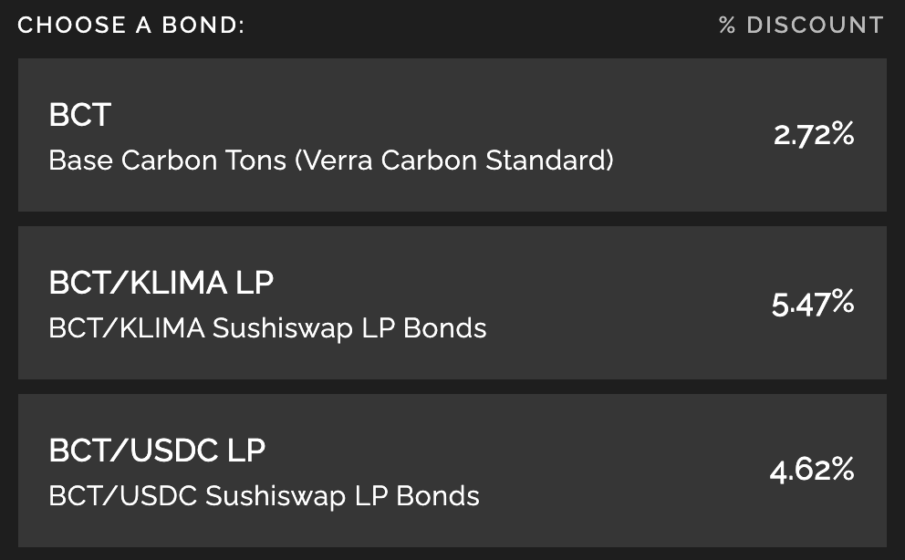

# OHM-Forks auf Polygon: KLIMA als Beispiel

Wenn du in den letzten Monaten die Krypto-News verfolgt hast, hast du sicherlich viele (3,3)-Referenzen bemerkt und von Ohm-ähnlichen Projekten gehört. Ich werde versuchen, dir kurz zu erklären, was diese Projekte sind, welche Regeln sie im Prinzip verfolgen und wie du sie als Teil deiner Anlagestrategie nutzen kannst. In diesem letzten Teil werden wir uns auf Klima DAO konzentrieren, eine der erfolgreichsten OHM-Forks auf Polygon, die auch eine sehr interessante GeschichtWas se und ein interessantes Ziel hat.

## Was sind OHM-Forks

### Was ist OHM und was ist eine Fork?

Alles begann im Ethereum Mainnet mit Olympus DAO. Ihr Ziel ist es, eine neue Reserve-Währung zu schaffen, die mit dem Dollar konkurrieren kann. Im Gegensatz zu anderen Stable Coins hat diese neue Währung einen schwankenden Wert. Der native Token (Ohm) muss vollständig durch einen Bestand an verschiedenen Vermögenswerten gedeckt sein. Die Tokenomics des Projekts resultieren jedoch darin, dass der Preis von Ohm durch den Markt bestimmt wird.

Olympus DAO startete im März 2021 und ist immer noch ein sehr erfolgreiches Projekt im Mainnet. Der TVL wird in Dutzenden von Millionen Dollar gehandelt, und der Ohm-Preis hält sich auf einem sehr hohen Niveau. Aufgrund dieses Erfolgs wurde das Projekt bereits ofts geforkt (kopiert) und mehrere Olympus DAO-Klone sind auf vielen Chains aufgetaucht.

### Übersicht über die Tokenomics

Dieser Abschnitt wird etwas technischer sein als unsere anderen Leitfäden, aber um den Erfolg von Olympus und anderen OHM-Forks zu verstehen, ist es wichtig zu verstehen, wie sie funktionieren.

Der Grundgedanke des Olympus-Protokolls ist es, die Treasury so weit wie möglich zu erhöhen, indem die nativen Token mit einem Preisnachlass verkauft werden, während das zirkulierende Volumen so niedrig wie möglich gehalten wird, um einen hohen Preis zu erzielen. Dies geschieht durch sehr hohe Belohnungen für Staker und die fast vollständige Kontrolle über die Liquidität durch das Protokoll.

* **Bonding:** Das Protokoll bietet seinen nativen Token zu einem vergünstigten Preis an. Der Preis wird mit bestimmten Vermögenswerten bezahlt, die zur Unterlegung des nativen Tokens verwendet werden. Im Beispiel von Olympus DAO ist der OHM-Token zu durch einige Token gedeckt, zu denen vor allem DAI gehören. Daher können Anleihen mit DAI direkt oder mit DAI-OHM LP-Token (und neuerdings auch mit FRAX) gekauft werden. Wenn jemand die nativen Token mit den Backing Assets oder LP-Tokens kauft, fließt die Zahlung direkt in die Treasury und ermöglicht es dem Protokoll, mehr Token zu prägen und somit länger zu laufen. Der einzige Nachteil ist, dass der vergünstigte Token erst nach einer Sperrfrist freigegeben wird, d.h. der Nutzer, der den nativen Token durch Bonding gekauft hat, kann ihn nicht sofort vollständig nutzen.
* **Staken:** Nach dem Bonding sammeln die Nutzer/innen die nativen Token ein und haben die Wahl, sie zu verkaufen oder sie zu staken. Um sicherzustellen, dass die letztere Option gewählt wird, bietet das Protokoll irrsinnig hohe Belohnungen für Staker (wir sprechen von 1,2% täglichem Gewinn!!!). Das Ziel hinter diesen hohen APRs ist es, eine Staking Ratio zu erreichen, die so nah wie möglich an 100% liegt. Wenn nicht viele Token im Umlauf sind, wird der Preis in die Höhe getrieben, und in Verbindung mit hohen Belohnungen wird es noch interessanter, zu staken. Nebenbei bemerkt: Ein steigender Preis trägt auch dazu bei, dass die Belohnungen hoch bleiben.
* **Erhöhung der Treasury und Kontrolle der Liquidität:** Die Treasury wird durch das Bonding und durch die Tatsache erhöht, dass native Token mit LP-Tokens gebunden werden können, die fast vollständig vom Protokoll kontrolliert werden. Diese LP-Tokens werden verwendet, um Swap-Gebühren für Nutzer/innen zu erheben, die es vorziehen, den nativen Token auf dem Markt zum vollen Preis zu kaufen, anstatt ihn zu binden (Details siehe nächstes Kapitel).
* **Rückkauf und Verbrennen:** Die meisten OHM-ähnlichen Projekte beinhalten einen Mechanismus, der die nativen Token zurückkauft und sie zu ganz bestimmten Anlässen verbrennt. Probleme treten auf, wenn die Nutzer/innen die nativen Token verkaufen und damit den Preis nach unten treiben. Wenn jemand seine Token verkauft, steigt der APY, da die Anzahl der geprägten Token bei weniger gestakenen Token gleich bleibt. Aber selbst bei einem höheren APY kann das Protokoll, wenn niemand die verkauften Token kauft und staked, diese möglicherweise vom Markt zurückkaufen, um Kaufdruck auszuüben, den Preis nach oben zu treiben und das zirkulierende Angebot niedrig zu halten. Token, die zurückgekauft werden, werden einfach vernichtet. Da ein Teil der Treasury für den Erwerb dieser Token verwendet wurde, würde ein Verbleib in der Treasury oder die Verteilung dieser Token die Treasury verwässern, was entweder die Belohnungsrate verringern oder die Zeiträume, in denen das Protokoll laufen kann, beeinträchtigen würde.

Weitere Informationen über das Konzept von Olympus DAO und seine Tokenomics findest du hier:

* [DeFi 2.0 - A new Narrative? Olympus DAO, Tokemak Explained](https://www.youtube.com/watch?v=l0vRTi8\_FRk)
* [WTF ist Olympus DAO](https://newsletter.banklesshq.com/p/wtf-is-olympus-dao)

### Bonding VS Staking

Warum sollte jemand für einen Token bezahlen, wenn es eine vergünstigte Version über eine Anleihe gibt? Das ist eine berechtigte Frage, und die Antwort hängt von dem Rabatt ab, den die Anleihe bietet.

Da wir mit der Klima DAO arbeiten, wollen wir den Kauf und das Staken mit dem Bonding vergleichen:

Wenn man direkt Klima auf dem Markt kauft und es 5 Tage lang staked (die eigentliche Haltefrist für Bonds), beträgt der ROI (**R**Rendite **O**n **I**Investment) 8,51%. Wenn man stattdessen eine Anleihe kauft, würde die maximale Rendite 5,47% betragen, indem man BCT/KLIMA anbietet.

Das bedeutet, dass du mit dem Gegenwert von $100 nach 5 Tagen Folgendes erhalten würdest

* $108,51 mit der 1. Option
* $105,47 mit der 2. Option

Es ist jedoch wichtig zu wissen, dass das Bonded Klima über den Vesting-Zeitraum freigegeben wird. Du kannst das gebundene Klima also ernten und staken, um von den Rebases (Ausschüttungen) zu profitieren. Da du nur Belohnungen für das bekommst, was du während der Vesting-Periode eingesetzt hast, und da es in den 5 Tagen bis zur vollständigen Freigabe des Bonds 15 Rebases gibt, können wir davon ausgehen, dass du vor jedem der 15 Rebases potenziell 6,67 % ernten kannst. Angenommen, du erntest und stakst zu Beginn jeder Rebase, würdest du folgendes erhalten:

| rebase # | Menge gestakt | Belohnung | Gesamtbelohnung |
| -------- | ------------- | --------- | --------------- |
| 1        | 7.031         | 0.038     | 0.038           |
| 2        | 14.063        | 0.077     | 0.116           |
| 3        | 21.094        | 0.116     | 0.232           |
| 4        | 28.125        | 0.155     | 0.397           |
| 5        | 35.157        | 0.193     | 0.580           |
| 6        | 42.188        | 0.232     | 0.812           |
| 7        | 49.219        | 0.271     | 1.083           |
| 8        | 56.251        | 0.309     | 1.392           |
| 9        | 63.282        | 0.348     | 1.740           |
| 10       | 70.313        | 0.387     | 2.127           |
| 11       | 77.345        | 0.425     | 2.552           |
| 12       | 84.376        | 0.464     | 3.016           |
| 13       | 91.407        | 0.503     | 3.519           |
| 14       | 98.439        | 0.514     | 4.061           |
| 15       | 105.470       | 0.580     | 4.651           |

Am Ende der Haltedauer wird der ROI von 5,47 % eingehalten, aber die Belohnungen für das Staken wurden um weitere 4,65 % erhöht (die der Einfachheit halber nicht aufgezinst wurden), sodass sich ein ROI von 10,12 % ergibt. Das bedeutet, dass das Bonding tatsächlich interessanter ist als das direkte Staken, auch wenn die ROI des Bonding geringer erscheint als die des Stakens.

Die gesamte Belohnung, die du erhältst, wenn du während der Haltedauer N-mal stakst (mit Nmax = maximal 15), beträgt:

$$Reward_{total} = \sum_{i=1}^{N}{\frac{Investment * i * (1 + APR_{Vesting})}{N} * APR_{staking}e$$

Du kannst dann deine eigenen Simulationen durchführen, um zu überprüfen, ob es besser ist, zu kaufen und zu staken oder zu bonden. In unserem Beispiel wäre bei einem ROI von 8,51 % beim Staken über 5 Tage ein Bonding-Rabatt von 3,95 % bei 15 Rebases besser (was einem ROI von 8,52 % entspricht).


Du kannst die gleiche Simulation mit Ernten + Staken nur einmal am Tag durchführen, anstatt dreimal am Tag vor jedem Rebase. Für denselben APY wie oben bräuchtest du einen Bindungsrabatt von 6,76 %, um eine bessere Rendite als beim Staken zu erzielen.



Du findest einen Simulator für deine Bonding-VS-Staking-Berechnung in Form einer [Google-Tabelle](https://docs.google.com/spreadsheets/d/1MTKTbf-ZAihGbEax3WEwkxToG7IlPKlwmYq59O3KG2o/edit#gid=0), die du kopieren und nach Belieben bearbeiten kannst. Beachte, dass diese Seite NICHT von der QiDAO-Gemeinschaft gepflegt und bereitgestellt wird.


### Das Besondere an Klima DAO

Die Besonderheit, die Klima DAO von anderen OHM-Forks unterscheidet, ist der wichtigste Token, der den Klima-Token stützt: der BCT-Token, der vom [Toucan Protocol](https://toucan.earth) bereitgestellt wird. Der BCT (**B**ase **C**arbon **T**onne) steht für Investitionen in die reale Welt, um die Erde zu dekarbonisieren, indem er Kohlenstoffkompensationen aus der realen Welt in Token umwandelt. In der [offiziellen Dokumentation](https://docs.toucan.earth/protocol/introduction/defi-refi) von Toucan kannst du mehr darüber lesen, wie das funktioniert.

BCT wird dann von der [Klima DAO-App](https://dapp.klimadao.finance) verwendet, um die KLIMA-Token zu prägen, genauso wie DAI von der Olympus DAO verwendet wird, um OHM zu prägen. Mit anderen Worten: Klima wirkt wie eine Kohlenstoffsenke und stellt reale Mittel zur Bekämpfung des Klimawandels bereit. Weitere Informationen findest du auf der [Klima-Website](https://www.klimadao.finance) und der [Dokumentation](https://klima-dao.gitbook.io/klima-dao/). Auf dem Discord-Server von QiDAO kannst du mit uns darüber diskutieren, wie wir Kryptowährungen grüner gestalten können.


Einer der Hauptunterschiede zwischen Olympus und Klima ist, dass BCT keinen stabilen Preis hat. Dies stellt ein höheres Risiko dar als bei Forks, die Stable Coins zum Aufbau ihrer Treasury verwenden. Es wird jedoch davon ausgegangen, dass Umweltprobleme immer mehr an Bedeutung gewinnen und es immer mehr Projekte geben wird, die versuchen, Kohlenstoff aus der Atmosphäre zu extrahieren, was wiederum den Gesamtwert von BCT erhöhen würde.


## Strategie 1: sKLIMA hebeln, oder (9,9)

Ohne tief in die [(3,3)-Spieltheorie](https://en.wikipedia.org/wiki/Nash\_equilibrium) einzutauchen, stellt (9,9) eine Situation dar, in der man eine gestakete Position hebelt. Das ist tatsächlich möglich, weil die Klima DAO einen sKLIMA-Token als Hinterlegungsnachweis bereitstellt, der von einer Plattform als Sicherheit für einen möglichen Kredit akzeptiert wird. Sehen wir uns die Details dazu an.

### Der Hebel-Loop mit MarketXYZ und Klima

Die Idee ist, dass du einen Anfangsbetrag an KLIMA-Token erhältst, den du bei Klima DAO einzahlen kannst. Dadurch kannst du einen sehr hohen APY erzielen (zum Zeitpunkt der Erstellung dieses Artikels liegt der APY bei 38.873,08%, d.h. 601% APR oder einem täglichen Gewinn von 1,68%) und durch die Einzahlung deines KLIMA-Tokens erhältst du sKLIMA als Einlagenachweis.

Dieser sKLIMA-Token kann am Markt XYZ im [Green Leverage Locker](https://polygon.market.xyz/pool/5) eingesetzt werden, wodurch du einen Kredit gegen diese Einzahlung aufnehmen kannst.


Nebenbei bemerkt hat Mai Finance eine Partnerschaft mit dem Markt XYZ geschlossen und den Green Locker Pool mit 1 Mio. MAI versorgt, um niedrige Zinssätze zu garantieren, wenn du MAI gegen deinen sKLIMA leihst.


Du bist nicht verpflichtet, MAI zu leihen. Du kannst dir den Token mit dem niedrigsten Zinssatz leihen, aber du musst bedenken, dass du für dein Darlehen Gebühren zahlen musst. Je schneller du dein Darlehen zurückzahlst, desto weniger Gebühren wirst du zahlen. Mit deinem Kredit kannst du weitere KLIMA-Tokens kaufen und den Kreislauf wiederholen. Du wirst feststellen, dass der effektive Jahreszins von sKLIMA die Zinsen für dein Darlehen weitgehend ausgleicht.


Es gibt einen Mindestbetrag, den du auf Market.xyz leihen musst. Bitte überprüfe das Limit, wenn du diese Strategie anwenden möchtest.


### Theorische Berechnung

Auf dem Markt XYZ gibt es auch Liquidationsstufen, d.h. wenn der Wert deiner Sicherheiten unter die Liquidationsstufe fällt, besteht das Risiko, dass du deine Sicherheiten verlierst. Um das Risiko einer Liquidation zu verringern, wird in der folgenden Simulation angenommen, dass du ein C/D-Verhältnis von 250 % beibehältst und anfänglich 1.000 $ an KLIMA-Token zu 38,873 % APY investierst, um MAI zu 20,49 % Zinsen zu leihen

| sKLIMA ($) | MAI Kredit ($) | eq. APY (%) | interests ($) |
| ---------- | -------------- | ----------- | ------------- |
| 1,000.00   | 400.00         | 38,873      | 81.96         |
| 1,500.00   | 560.00         | 54,455      | 114.74        |
| 1,560.00   | 624.00         | 60,642      | 127.86        |
| 1,624.00   | 649.60         | 63,129      | 133.10        |
| 1,649.60   | 659.84         | 64,125      | 135.20        |
| 1,659.84   | 663.94         | 64,523      | 136.04        |
| 1,663.94   | 665.57         | 64,682      | 136.38        |

Natürlich ist es möglich, nach 3 Schleifen aufzuhören, da der entsprechende APY danach nicht mehr viel wachsen wird.

Nebenbei bemerkt: Da die Anfangsinvestition $1.000 beträgt, würde der Wert, den du am Ende eines Jahres erhältst, $646.820,00 betragen, vorausgesetzt, alles bleibt gleich. Mit anderen Worten: Wenn du 1.000 USD investierst, musst du 665,57 USD mit zusätzlichen 136,38 USD zurückzahlen (eine aufgelaufene Schuld von 801,95 USD), aber du wirst auch 646.820 USD verdienen.

Du siehst auch, dass der Wert deiner sKLIMA-Position sehr schnell wächst (etwa 8 % alle 5 Tage), was bedeutet, dass du an dieser Stelle auch deine Schulden erhöhen und noch mehr Hebelwirkung für zusätzliche Gewinne einsetzen kannst.

### Gewinne realisieren und den Kredit zurückzahlen

Eines der Hauptprobleme bei OHM-Fork-Projekten ist, dass sie davon ausgehen, dass alle staken und niemand verkauft. Wenn aber niemand verkauft, hat auch niemand etwas davon und in den meisten Fällen bekommt der Erste, der verkauft, den Kuchen.

Bei jeder Anlagestrategie ist es wichtig, dass du den Wert deiner Gewinne mitnimmst. Das kannst du tun, indem du einen Teil deiner sKLIMA-Position am Markt XYZ abziehst und KLIMA zurückbekommst, das du verkaufen kannst.

Wenn du $100 investierst und die 7 Schleifen wie oben beschrieben betreibst, hätte deine Investition in KLIMA nach 31 Tagen $67,11 eingebracht, was bedeutet, dass du dein Darlehen mit Zinsen in einem einzigen Monat vollständig zurückzahlen kannst. Wenn du das tust, fängst du im nächsten Monat wieder mit 166$ an und hast keine Schulden mehr. Behalte nur den effektiven Jahreszins im Auge, der am Markt XYZ ziemlich hoch werden kann.

## Strategie 2: Kontinuierliche Investition, (4,4)

Auch hier hat (4,4) mit der Spieltheorie und den Reservewährungen zu tun und deutet auf jemanden hin, der seine Token bondet und sie dann staked. In dieser Strategie werden wir sehen, wie wir Klima und Augury nutzen können, um regelmäßig Anleihen zu kaufen und sie kontinuierlich zu staken.

### Der Investment-loop mit Augury und Mai Finance

Wir verwenden immer noch Klima, aber dieses Mal verwenden wir eine [Infusion von Augury Finance](https://augury.finance/infusions), um die Extraktion des Wertes von Klima zu automatisieren. Wenn du deine KLIMA-Token in die Infusion einzahlst, führt der Algorithmus, der für die Infusion zuständig ist, nach jeder Rebase die folgenden Aktionen durch:

* 50% der geernteten KLIMA werden wieder eingesetzt, um deine sKLIMA-Position zu erhöhen
* 50 % der geernteten KLIMA werden für USDC verkauft, die dem NFTM-Pool in Augury hinzugefügt werden, und an dich als NFTM-Token verteilt

Der NFTM kann dann entweder gehalten werden, während er an Wert gewinnt, oder gegen seinen USDC-Wert eingelöst werden. Mit anderen Worten: Es spielt keine Rolle, ob der KLIMA-Token nach einem Rebase an Wert verliert, da sein Wert als NFTM erfasst und gespeichert wird.

Nachdem du den USDC-Wert deiner NFTM-Belohnung eingelöst hast, kannst du den Token deiner Wahl kaufen und ihn in einem Vault in Mai Finance aufbewahren. Im obigen Beispiel wird ein camWETH Vault verwendet, aber du kannst eigentlich jeden beliebigen Vault benutzen. Die Idee ist, dass du die Vaults bei Mai Finance nutzen kannst, um MAI zu leihen und neue Anleihen bei Klima DAO zu kaufen, um den Kreislauf zu wiederholen. Dann kannst du die KLIMA-Token ernten und sie in Augury injizieren. Es ist also durchaus möglich, regelmäßig zu ernten und auf Augury zu staken, bevor deine Anleihe vollständig gevestet ist.

### Theoretische Ergebnisse

Angenommen, du investierst $100 wie im vorherigen Beispiel direkt in den Augury Vault, der effektive Jahreszins des Klima Vault beträgt 552,94% (aktueller Wert zum Zeitpunkt der Erstellung dieses Artikels) und du möchtest eine C/D Ratio von 240% und einen effektiven Jahreszins von 2,19% auf dem camWETH Vault beibehalten, dann sehen die Ergebnisse über ein Jahr wie folgt aus:

| day | sKLIMA ($) | wETH ($)  | MAI Kredit ($) |
| --- | ---------- | --------- | -------------- |
| 30  | 137.751    | 27.708    | 11.545         |
| 60  | 189.776    | 64.883    | 27.035         |
| 90  | 261.474    | 116.150   | 48.396         |
| 120 | 360.282    | 186.835   | 77.848         |
| 150 | 496.453    | 284.283   | 118.451        |
| 180 | 684.115    | 418.613   | 174.422        |
| 210 | 942.737    | 603.771   | 251.571        |
| 240 | 1,299.152  | 858.978   | 357.907        |
| 270 | 1,790.339  | 1,210.720 | 504.466        |
| 300 | 2,467.258  | 1,695.500 | 706.458        |
| 330 | 3,400.140  | 2,363.625 | 984.844        |
| 360 | 4,685.775  | 3,284.424 | 1,368.510      |

Noch einmal: Unter der Annahme, dass alle Kurse und Preise gleich bleiben, hättest du am Ende des Jahres

* KLIMA-Tokens im Wert von 4.684,775 $
* wETH im Wert von 3.284,424 $
* und ausstehende Schulden in Höhe von $1.368,510

Das entspricht einem effektiven Jahreszins von 6.866,46%. Das ist zwar weit entfernt von den 38.705,13%, mit denen KLIMA wirbt, aber immer noch ziemlich beeindruckend für eine Investition von 100$. Außerdem wurde ein großer Teil deiner Gewinne in einem Vault bei Mai Finance in WETH umgewandelt, und für dein Darlehen bei Mai Finance bekommst du zusätzliche Qi-Token.


Diese Strategie hat zwar einen viel niedrigeren effektiven Jahreszins als die reine (9,9), aber sie ist auch relativ günstig, da du mit so viel KLIMA einsteigen kannst, wie du willst.


## Haftungsausschluss

Alles, was in diesem Dokument vorgestellt wird, ist reine Theorie und wird für Bildungszwecke vorgeschlagen. Das größte Problem bei Projekten wie Olympus und Klima ist, dass wieder einmal der erste Nutzer, der verkauft, von dem hohen Preis profitiert. Wenn der erste Verkauf massiv ist (weil die Gewinne massiv sind), kann es schnell zu einem Panikeffekt kommen, der den Preis des KlIMA-Tokens zerstören kann. In diesem Fall würde der APY jedoch in die Höhe schießen, was bedeutet, dass Nutzer/innen, die nicht verkaufen, von sehr hohen Belohnungen profitieren, so dass, wenn der APY neue Nutzer/innen anzieht, diejenigen, die ihn gehalten haben, die großen Gewinner/innen sein werden.

Es ist auch gut zu wissen, dass das Projekt nur so lange Token drucken kann, wie zusätzliche Mittel in die Treasury fließen.

Das Risiko kann also sehr hoch sein, wenn du nicht von Zeit zu Zeit etwas herausholst, um das Risiko zu senken.

Abschließend sei darauf hingewiesen, dass OHM-Forks der neue Trend sind, aber die meisten Projekte können scheitern, und viele dieser Forks sind keine soliden Projekte. Viele dieser Forks sind keine soliden Projekte. Aufgrund ihrer Natur sind sie noch nicht von RugDoc überprüft worden, und es kann sehr kompliziert sein, echte Anwendungen von reinem Betrug zu unterscheiden.


Denke daran, dass eine Strategie, die zu einem bestimmten Zeitpunkt gut funktioniert, zu einem anderen Zeitpunkt schlecht abschneiden (oder Geldverluste erzeugen) kann. Bitte bleibe informiert, beobachte die Märkte, behalte deine Investitionen im Auge und recherchiere wie immer selbst.

