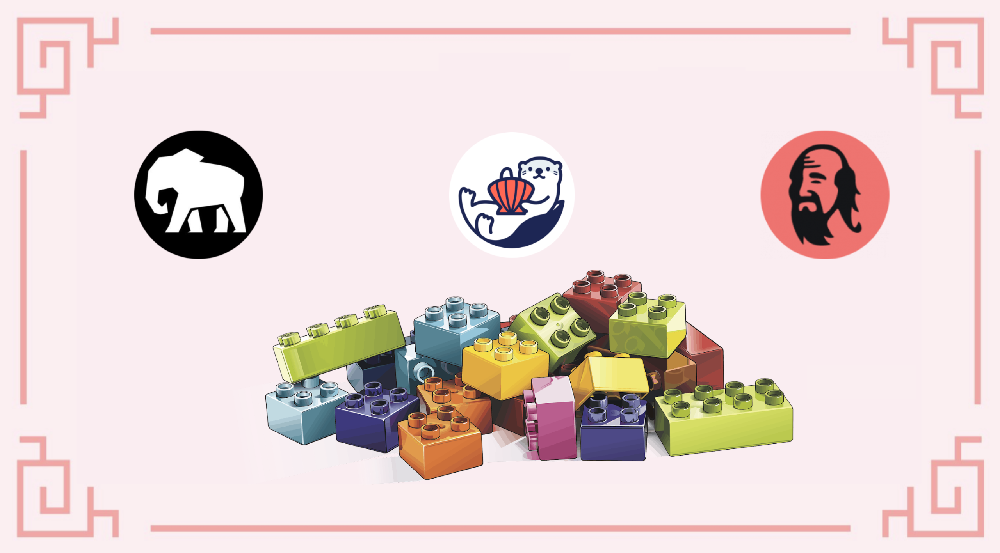
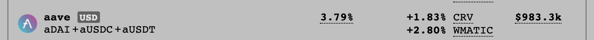
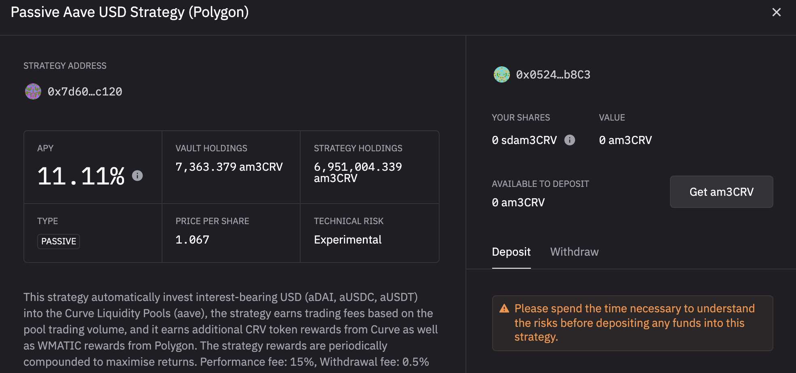
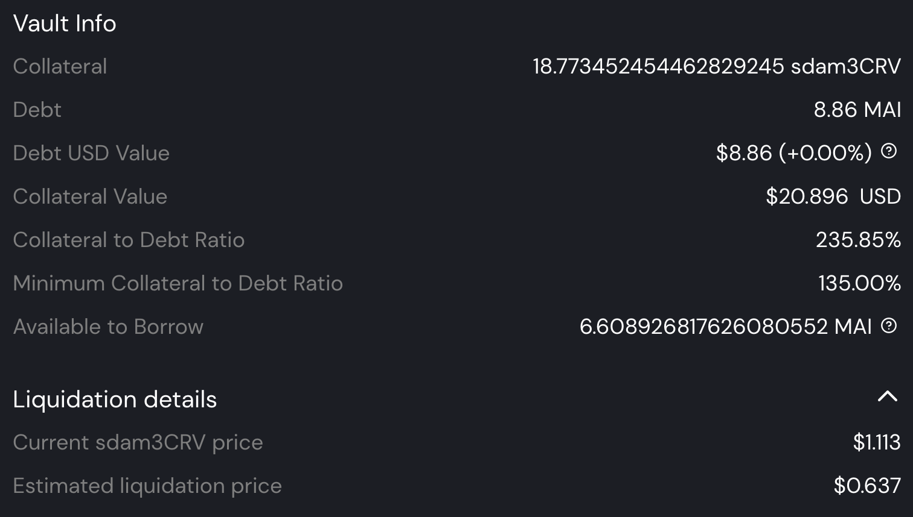
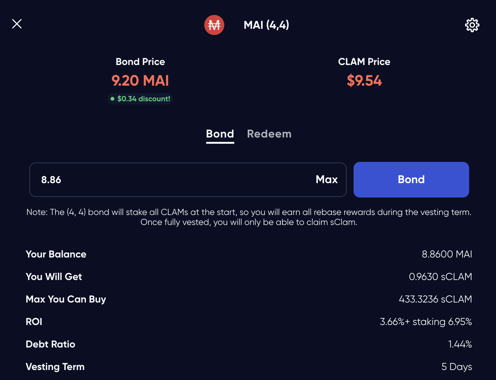
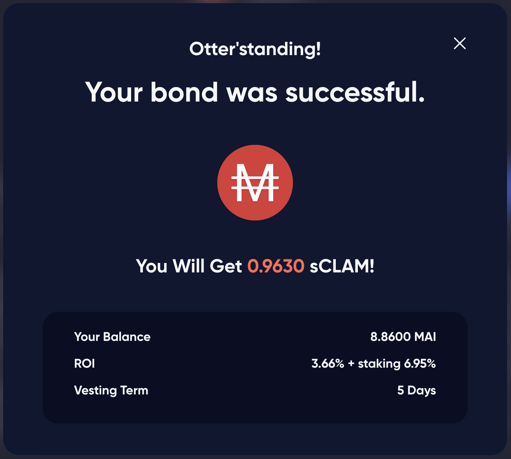
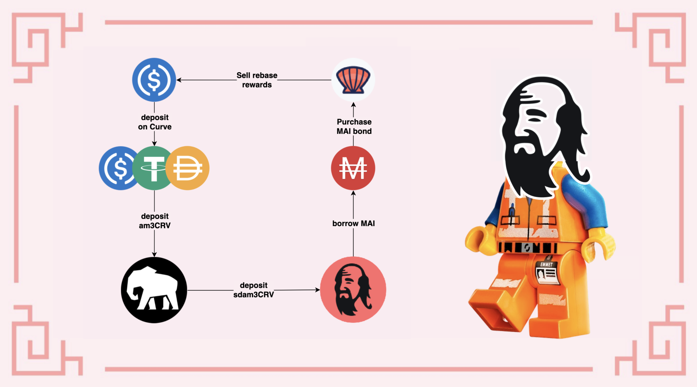

# Der Elefant, der Qimp und der Otter

## Einleitung

Das könnte ein guter Titel für ein Gedicht sein, aber es scheint, dass dies die 3 Totemtiere der Protokolle sind, die wir in diesem Leitfaden besprechen werden. Heute schauen wir uns einen der neuesten ( Stand: Januar 2022) Token an, die den MAI Stable Coin auf Mai Finance unterstützen: den sdam3CRV-Token. Wir erklären im Detail, was er ist und wie du ihn bekommen kannst. Dann schlagen wir dir eine kleine Strategie vor, wie du ihn nutzen und hohe Renditen erzielen kannst, indem du den Stable Receipt Token von Stake DAO, Mai Finance und das OtterClam-Protokoll als Multiplikator für die Belohnung nutzt.

## Stake DAO

### Vorstellung von Stake DAO

[Stake DAO](https://app.stakedao.org) ist eine Plattform zur Renditeoptimierung, auf der die Nutzer/innen ihr Vermögen einzahlen und die Plattform die am besten kuratierten Strategien anwenden lassen können, um die Renditen zu maximieren. Die Investitionen werden mit einer Risikobewertung vorgeschlagen und auf einem übersichtlichen Dashboard angezeigt, das es einfach macht, die Ergebnisse der gewählten Strategien zu verfolgen. Stake DAO wurde zunächst auf dem Ethereum Mainnet eingeführt, expandiert aber schnell auf andere Chains wie Polygon und Avalanche. Mehr über Stake DAO erfährst du natürlich in der [offiziellen Dokumentation](https://stakedao.gitbook.io/stakedaohq/).

### Die am3CRV Strategie

Für unseren Leitfaden werden wir die "Passive Aave USD Strategie" für Polygon verwenden. Diese Strategie nutzt den am3CRV-Pool von [Curve Finance](https://polygon.curve.fi): Du zahlst dein stabiles Vermögen (USDC, USDT oder DAI) in den Aave-Pool von Curve ein und erhältst einen Receipt-Token von am3CRV. Diesen Token kannst du direkt bei Curve staken, um CRV- und WMATIC-Belohnungen zu erhalten. Du kannst diesen Token aber auch bei Stake DAO einzahlen und die CRV- und WMATIC-Belohnungen werden verkauft und zu deiner stabilen Position hinzugezählt.

Wie du oben siehst, würdest du mit dem Staken deiner am3CRV-Token auf Curve einen Gesamt-APR von 8,35% erhalten (**A**nnual **P**ercentage **R**eward). Wenn du auf Stake DAO triffst, findest du auf der Registerkarte `Strategien` für Polygon die Strategie, die die am3CRV-Token verwendet, bei der du deine Quittungstoken einzahlen und 11,11% APY (**A**nual **P**ercentage **Y**ield, das setzt voraus, dass du deine Belohnungen mindestens täglich zusammensetzt) verdienen kannst.

Wenn du deine am3CRV-Tokens bei Stake DAO einzahlst, erhältst du einen neuen Quittungstoken: sdam3CRV (_**s**_take _**d**_ao am3CRV).


Bitte beachte, dass Stake DAO für jede Strategie, die du verwendest, Gebühren auf deine Gewinne erhebt. In unserem Fall beträgt die Performancegebühr ab Januar 2022 15 %, und es wird auch eine 0,5 %ige Auszahlungsgebühr erhoben. Vergewissere dich, dass du das verstehst, bevor du dem Pool beitrittst.


Diese Strategie kann als sehr sicher angesehen werden (DYOR), da sie nur Stable Coins verwendet. Das impermanente Verlustrisiko ist so gut wie null, da der am3CRV LP-Token nur aus Stable Coins besteht, die an den US-Dollar gebunden sind. Wenn du Stake DAO nutzen möchtest, solltest du jedoch die Risiken des Smart Contracts berücksichtigen, da dein Vermögenswert über Curve auf AAVE geliehen wird und der LP-Token auf Stake DAO liegt, so dass du 3 Protokollebenen hast, die Risiken ausgesetzt sind.

Du kannst das Farm-Instrument auf Stake DAO nutzen, um deine sdam3CRV-Token zu hinterlegen und bekommst \~9% zusätzlich in SDT-Token, dem nativen Token von Stake DAO, ausgezahlt. Für unseren Leitfaden werden wir den sdam3CRV-Token jedoch anders verwenden.

## Mai Finance

[Mai Finance](https://app.mai.finance) ist ein Kreditprotokoll, bei dem du dein Vermögen als Sicherheiten hinterlegen und dafür einen Kredit aufnehmen kannst. Es handelt sich nicht um eine gewöhnliche Kreditplattform, auf der du Leute findest, die ihr Vermögen an Kreditnehmer/innen verleihen. Bei Mai Finance verleihst du nur an dich selbst und leihst dir nur die Vermögenswerte, die du besitzt. Weitere Informationen über Mai Finance findest du auf dieser Seite oder in der Dokumentation(https://docs.mai.finance).

Im Januar 2022 wurde der sdam3CRV-Token als Sicherheitenoption bei Mai Finance zugelassen. Das bedeutet, dass der Token, der durch die Hinterlegung deiner am3CRV-Quittung auf der Stake DAO entstanden ist, nun verwendet werden kann, um den Stable Coin von MAI zu leihen. Das ist aus mehreren Gründen besonders toll:

* der sdam3CRV-Token besteht nur aus Stable Coins, daher sollte er nicht von Impermanent Loss betroffen sein und einen stabilen Preis haben
* Da sich der Preis nicht stark verändert, ist es relativ einfach, Liquidationen zu vermeiden, selbst wenn du dir Geld in der Nähe der Liquidationsgrenze leihst.
* deine Sicherheiten steigen im Wert, weil sie ein renditeträchtiger Vermögenswert sind. Zum Zeitpunkt der Erstellung dieses Leitfadens bekommst du 11% APR auf deine Sicherheiten

Dieser Vault verwendet ein hohes CDR (**C**ollateral zu **D**ebt **R**atio), weil wir immer versuchen, die Sicherheit in den Leitfäden auf dieser Website zu fördern. Ein hohes CDR hat einige Vorteile:

* Er bewahrt dich vor der Liquidation im Falle größerer negativer Kursbewegungen deiner Sicherheiten
* Du kannst einen großen Teil deiner Sicherheiten abziehen und verkaufen, um deine Schulden zu tilgen (siehe unseren [Leitfaden zur Schuldentilgung](../../debt-management-tutorials/debt-repayment-why-and-when.md))

Es steht dir jedoch frei, ein CDR zu wählen, das zu deiner Risikotoleranz passt.


Der sdam3CRV Vault nutzt Stable Coins als Sicherheiten. Wie der camDAI Vault erhält er KEINE Anreize zur Kreditaufnahme. Seine Liquidation Ratio kann wie beim camDAI Vault auf 110% gesenkt werden.


Mit dem MAI kannst du Kredite gegen deine Sicherheiten aufnehmen, du kannst deine Position hebeln. Wenn du Details benötigst, lies bitte unseren speziellen Leitfaden zum [Hebeln von camDAI](camdai-beginner-strategy.md) und wende ihn auf deine sdam3CRV-Token an. Du kannst in der Tat ein viel größeres Engagement in den von Stake DAO angebotenen Kursen erreichen, indem du einfach ein paar Hebelschleifen anwendest. Allerdings gerät der MAI-Token dadurch unter starken Verkaufsdruck, weshalb wir einen anderen Ansatz vorschlagen.

## OtterClam DAO

[OtterClam Finance](https://app.otterclam.finance) ist eine einzigartige Ohm-Fork auf Polygon, die sehr innovativ ist und coole NFTs in ihre Plattform integriert. OtterClam wurde im November 2021 gegründet und hat seit seiner Gründung viel Wachstum gesehen und bewegt sich nun in Richtung GameFi.

Eines der interessantesten Dinge an OtterClam ist seine Partnerschaft mit dem QiDao-Protokoll, das hinter Mai Finance steht. Der größte Teil der Stable Coins, mit denen der CLAM-Token unterlegt ist, besteht aus MAI, dem Stable Coin, der auf Mai Finance geprägt wird. Das bedeutet, dass du CLAM-Anleihen direkt mit MAI kaufen kannst, und das ist genau das, was wir in unserer Strategie tun werden. Ohm-Forks sind dafür bekannt, dass sie sehr hohe Belohnungen bieten, und OtterClam ist da keine Ausnahme. Eine weitere Besonderheit der Anleihen auf OtterClam ist, dass du sCLAM (gestakete CLAM-Tokens) kaufst, so dass die Tokens während der gesamten Haltedauer Belohnungen erhalten, was die Anleihen noch attraktiver macht.

Auf diesem Screenshot siehst du, dass wir sCLAM tatsächlich mit einem Abschlag von 3,66% kaufen (der Kaufpreis beträgt 9,20 MAI, während der Marktpreis bei 9,54 $ liegt), aber während der gesamten Sperrfrist von 5 Tagen werden die gekauften sCLAM auch um 6,95% wachsen. Aufgrund der sehr hohen Belohnungen (13.400% APY zum Zeitpunkt der Erstellung dieses Artikels) wird es wichtig sein, die sCLAM-Token gestaked zu halten, aber wir werden die gestaketen Belohnungen für Stable Coins verkaufen und sie auf Curve einzahlen, um unsere am3CRV-Position zu erhöhen.

Wenn du dir den Preis von CLAMs ansiehst, wirst du sehen, dass dieser Token sehr volatil ist. Wie bei den meisten Ohm-Forks ist der Preis des Tokens irrelevant, wir verwenden OtterClam nur als Multiplikator für die Gewinne. Ohm-Forks sind darauf ausgelegt, den Token-Preis auf 1 US-Dollar zu senken (oder auf den Wert des Tokens), und der Token ist eine "Reservewährung", d. h. er ist dazu gedacht, verwendet und gekauft/verkauft zu werden.


Belohnungen für das Staken werden in den gesperrten sCLAM-Tokens angesammelt, können aber während der Haltedauer nicht abgerufen werden. Wir müssen warten, bis die Token vollständig entsperrt sind, bevor wir die Belohnungen für das Staken sammeln und verkaufen können.


## Farming Strategie

Wie in den meisten Fällen ist der beste Ausgangspunkt für Strategien, mit Stable Coins zu beginnen. Auf diese Weise reduzierst du das Risiko impermanenter Verluste und arbeitest nur mit den Gewinnen aus deinem Farmen (oder in unserem Fall mit dem geliehenen Betrag). Die Schleife beginnt also mit der Einzahlung von Stables auf Curve, um einen am3CRV-Token zu erhalten. Dieser Quittungstoken wird bei Stake DAO hinterlegt, damit du eine sdam3CRV-Quittung erhältst. Dieser Token wird bei Mai Finance als Sicherheit hinterlegt, um MAI zu leihen. Der Kredit wird verwendet, um MAI-Anleihen auf OtterClam zu kaufen. Die Belohnungen der Rebase werden in stabilere Coins getauscht. Nebenbei bemerkt: Du kannst die Belohnung in beliebiger Höhe verkaufen. Für unseren Leitfaden werden wir 100% davon verkaufen, aber du kannst einen Teil behalten, um deine CLAM-Position schneller zu erhöhen und größere Belohnungen zu erhalten.

Wie immer bei Simulationen werden wir alle Zahlen wie folgt festlegen:

* APY für die sdam3CRV-Strategie auf Stake DAO ist 11,11%
* APR für gestakte CLAMs auf OtterClam ist 13.400%

Wir werden uns auch nicht mit der Schuldentilgung befassen und nehmen an, dass alle Preise gleich bleiben. Wir lassen die Simulation mit USDC im Wert von 100$ als Ausgangspunkt laufen und versuchen auch, einen CDR von 235% einzuhalten, wenn mehr MAI geliehen wird. Schließlich nehmen wir der Einfachheit halber an, dass am Ende jeder Sperrfrist eine MAI-Anleihe mit einem Abschlag von 0 % verfügbar ist (du wirst natürlich nach Abschlägen von mehr als 0 % suchen).

### Tag 1

An Tag 1 kannst du so ziemlich alles vorbereiten:

* Deponiere deine USDC im Wert von $100 (oder USDT oder DAI, das bleibt dir überlassen) bei Curve finance
* Hinterlege deinen am3CRV-Quittungstoken bei Stake DAO
* Hinterlege deinen sdam3CRV Quittungstoken bei Mai Finance
* Nimm einen Kredit mit einem CDR von 200% auf, oder $50 in MAI für einen ersten Kredit
* Kaufe eine MAI-Anleihe auf OtterClam Finance

Jetzt musst du nur noch die gesamte Sperrfrist abwarten, um deine Belohnung zu erhalten. Am Ende von Tag 1 hättest du

| Position             | Wert ($) |
| -------------------- | -------- |
| sdam3CRV             | 100.000  |
| MAI loan             | 50.000   |
| sCLAM                | 50.000   |
| Zusätzliche sdam3CRV | 0.030    |
| Zusätzliche sCLAM    | 0.000    |

### Tag 2, 3 & 4

Es gibt nichts zu sagen, dein sdam3CRV sammelt Renditen, aber das war's dann auch schon, es gibt nichts zu ernten, solange die Anleihe gesperrt ist.

### Tag 5

Am Ende von Tag 5 ist die Anleihe vollständig entsperrt, und da die Belohnung während der gesamten Sperrfrist aufgezinst wurde, hättest du am Ende des Tages

| Position             | Wert ($) |
| -------------------- | -------- |
| sdam3CRV             | 100.122  |
| MAI Kredit           | 50.000   |
| sCLAM                | 53.382   |
| Zusätzliche sdam3CRV | 0.030    |
| Zusätzliche sCLAM    | 0.722    |

### Tag 6

Du hast einige zusätzliche sdam3CRV-Tokens, gegen die du dir eine neue Anleihe kaufen kannst. Dies wird eine sehr kleine Anleihe sein (vorerst nur ein paar Cent), aber mit der Zeit wirst du mit deinem neuen MAI immer mehr sCLAM kaufen können. Am Ende von Tag 6 hast du dann

| Position             | Wert ($) |
| -------------------- | -------- |
| sdam3CRV             | 100.875  |
| MAI Kredit           | 50.437   |
| sCLAM                | 53.820   |
| Zusätzliche sdam3CRV | 0.031    |
| Zusätzliche sCLAM    | 0.728    |

Zu diesem Zeitpunkt werden deine gestaketen CLAMs jeden Tag Belohnungen produzieren, die du in deinem sdam3CRV Vault aufstocken kannst, oder du kannst sie einfach alle 5 Tage aufstocken, wenn die Anleihe entsperrt ist.

### Tägliche Routine

Die tägliche Routine so aus

* Nimm den Gegenwert von 3 Rebases von deinen gestaketen CLAMs ab
* verkaufe sie für den Stable Coin, den du je nach Marktlage am meisten bekommen würdest
* zahle den zusätzlichen Stable in den Aave-Pool bei Curve Finance ein
* hinterlege den am3CRV-Token bei Stake DAO
* hinterlege den sdam3CRV-Token bei Mai Finance

Dann kannst du alle 5 Tage die folgenden zusätzlichen Schritte durchführen:

* zusätzliche MAI leihen, um einen CDR von 200% zu halten
* zusätzliche MAI-Anleihe auf OtterClam kaufen

### Roh Ergebnisse über die Monate

| Tag | sdam3CRV  | CLAM    | MAI Schulden |
| --- | --------- | ------- | ------------ |
| 30  | 121.249   | 64.007  | 60.625       |
| 60  | 150.866   | 78.815  | 75.433       |
| 90  | 187.350   | 97.057  | 93.675       |
| 120 | 232.294   | 119.529 | 116.147      |
| 150 | 287.659   | 147.212 | 143.830      |
| 180 | 355.863   | 181.314 | 177.931      |
| 210 | 439.882   | 223.323 | 219.941      |
| 240 | 543.383   | 275.074 | 271.691      |
| 270 | 670.884   | 338.825 | 335.442      |
| 300 | 827.950   | 417.358 | 413.975      |
| 330 | 1,021.437 | 514.101 | 510.719      |
| 360 | 1,259.790 | 633.277 | 629.894      |

### Tag 365

Nach einem ganzen Jahr Farmen dieses Systems und unter der Annahme, dass alles so ist wie an Tag 1 (Preise, Kurse und alles andere ...), hättest du:

* sdam3CRV-Token im Wert von $1.304,575 in deinem Vault bei Mai Finance
* CLAM im Wert von 655,670 $ bei OtterClam Finance
* Schulden im Wert von 652,288 $ bei MAI

Du siehst, dass du am Ende des Jahres immer noch ein CDR von 200% hast. Du könntest deine Sicherheiten zurückziehen, um deine Schulden zu tilgen und den Rest deiner Sicherheiten freizugeben. Du kannst deine Schulden auch zurückzahlen, indem du deine CLAMs verkaufst und 100% deiner Sicherheiten freischaltest.

Bei einer anfänglichen Investition von $100 hättest du am Ende $1.307,958 und eine Schuld von $652,288, was einem Gesamt-APY von 1.207,958% entspricht.


Wenn du nur 50% deiner Belohnung aus OtterClam Finance entnimmst und den Rest gestaked lässt, wird der hohe APY auf eine Position angewendet, die viel schneller wächst. Das birgt zwar mehr Risiken, aber unter der Annahme, dass alles beim Alten bleibt und du nur 50 % deiner Belohnung verkaufst, hättest du am Ende möglicherweise 3.608,447 $, die du zwischen deinem Vault und OtterClam aufteilst, und eine Schuld von 750,828 $, was einem effektiven Jahreszins von 2.757,619 % entspricht.


## Haftungsausschluss

Diese Strategie ist ziemlich interessant, weil sie ein sehr geringes Risiko auf der Anfangsseite darstellt. Dein Geld wird nämlich aus den Stablecoins abgezogen, und der Anfangsbestand ist "geschützt", so dass die Wahrscheinlichkeit, ihn zu verlieren, sehr gering ist. Das Liquidationsrisiko ist ebenfalls sehr gering, da der CDR sehr hoch ist und der Preisunterschied zwischen der Sicherheit und dem geliehenen Vermögenswert sehr gering ist. Ohne zusätzliche Tools würdest du wahrscheinlich \~12% APY bekommen, aber es ist klar, dass die Verwendung anderer Protokolle zur Maximierung der Belohnung zu sehr hohen Renditen führen kann.

Vergewissere dich jedoch, dass du diese Anlagestrategie bis ins kleinste Detail verstehst. Stelle sicher, dass du die Risiken der Smart Contracts akzeptierst, denn wir verwenden viele verschiedene Protokolle. Außerdem musst du verstehen, wie Ohm-Forks funktionieren und nicht auf den Preis von CLAMs achten, der stark schwanken kann. Und schließlich: Auch wenn die Preise auf Stake DAO gleich bleiben _können_, wird die Belohnung auf OtterClam mit Sicherheit im Laufe der Zeit sinken, da Ohm-Forks solch hohe APYs nicht über lange Zeiträume halten können. Wie immer solltest du die Dokumentation der verschiedenen Projekte lesen, die du nutzen willst, und sicherstellen, dass du alle Risiken verstehst.


Dieser Leitfaden ist definitiv keine Finanzberatung, sondern wurde mit einem pädagogischen Ziel erzeugt. Du musst auf Preisschwankungen, Angebot und Nachfrage, Belohnungsprogramme, Endtermine, impermanente Verluste usw. achten ... Das Ziel war nicht, Rezepte vorzuschlagen, die man blind befolgen kann. Mach also bitte deine Hausaufgaben und deine eigenen Simulationen und investiere nur so viel, wie du bereit bist, möglicherweise zu verlieren.

