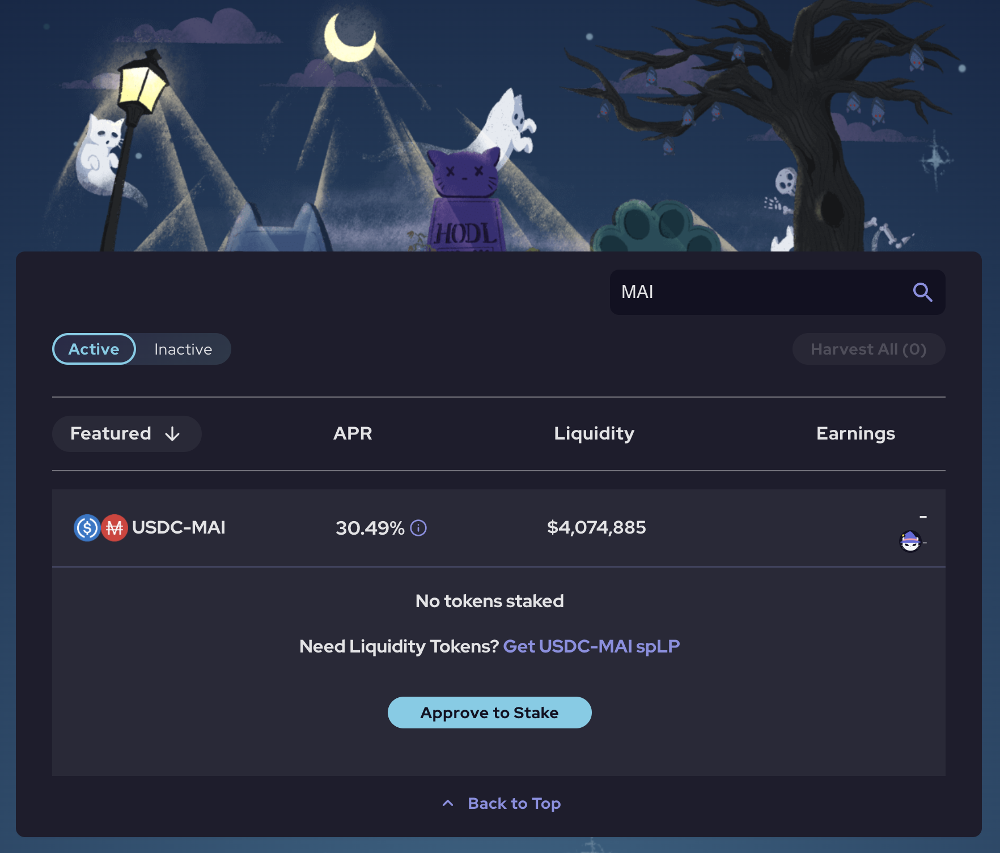
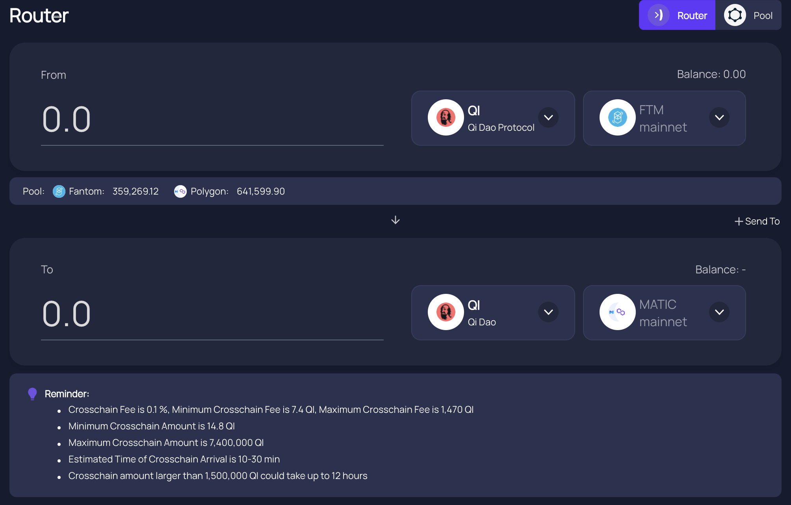
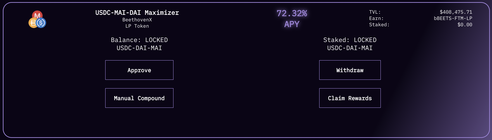

# Que faire avec MAI sur Fantom

## Objectif de cet article

Le but de cet article n'est pas de présenter en détail ce que vous pouvez faire avec votre pièce stable MAI, mais d'avoir une liste de tous les sites web et de l'application DeFi que vous pouvez utiliser sur Fantom et qui vous permettront d'utiliser votre MAI directement, ou en combinaison avec d'autres pièces stables. Pour plus de détails sur les façons spécifiques d'utiliser le MAI, vous pouvez vous référer à d'autres tutoriels sur ce site, ou obtenir de l'aide sur Discord ou Telegram.

Veuillez noter que la liste n'est pas complète, et ne le sera jamais puisqu'il y a de nouvelles dapps qui se lancent chaque semaine sur le réseau. Je ne peux pas toutes les passer en revue, donc je ne présenterai que les options principales, ou les options les plus célèbres / les plus "sécurisées".

Si vous souhaitez qu'un projet particulier soit répertorié, veuillez rejoindre la communauté Qi sur [Discord](https://discord.com/invite/mQq55j65xJ).

## Farmer de manière sécurisée avec des projets de premier ordre

Les projets de premier ordre sont les applications DeFi qui se sont avérées solides et présentent un risque moindre. Ils font généralement l'objet d'un audit et l'équipe à l'origine de ces projets y travaille depuis longtemps. Ils n'ont généralement pas de APR (TAEG, taux annuel en pourcentage) très élevés, mais on peut leur faire confiance.

### BeethovenX

[BeethovenX](https://app.beets.fi/#/) est un fork de Balancer, un projet qui n'a pas été lancé sur Fantom, mais dont la présence est bien établie sur d'autres réseaux. Comme Balancer, BeethovenX est un gestionnaire de portefeuille automatisé, un fournisseur de liquidités et un capteur de prix. Sur la plateforme, vous pourrez prêter vos crypto et vous percevrez des commissions sur les transactions. Si vous avez besoin de plus d'informations sur les projets, veuillez visiter leur [documentation officielle](https://docs.beethovenx.io).

L'équipe de BeethovenX ne s'est pas contentée de fork Balancer, elle a également créé des fonctionnalités supplémentaires étonnantes (gestion de portefeuille, suivi des jetons BEETS natifs, récompenses pouvant être réclamées à tout moment). Et tout cela avec un univers et une histoire fantastiques, qui les ont aidés à créer une communauté fantastique.

Sur Fantom, vous pourrez ajouter votre MAI dans la pool `Guqin Qi V2` qui est composé de MAI (65% du pool), DAI (17,5% du pool) et USDC (17,5% du pool), et l'APR (Annual Percentage Revenue) fluctue entre 20% et 30%, payé en BEETS et les frais de swap.

Comme pour Balancer, la meilleure chose à propos de BeethovenX est probablement le fait que vous n'avez pas besoin de fournir le ratio exact pour le pool. L'algorithme qui maintient l'équilibre correct entre les 3 actifs prendra le dépôt que vous avez et vendra/achetera des jetons pour s'assurer que l'équilibre est maintenu. De cette façon, vous pouvez simplement déposer MAI et laisser le pool faire le reste.

BeethovenX est également la meilleure application si vous voulez échanger votre MAI contre une autre devise en utilisant la fonction d'échange.

### SpookySwap

[SpookySwap](https://spookyswap.finance) est probablement l'un des meilleurs DEX sur Fantom où vous pourrez échanger vos jetons ERC20, fournir des liquidités et des rendements, créer des jetons LP (Liquidity Provider), staker leur jeton natif BOO, et vous pouvez même faire le pont entre certains actifs de Fantom et d'autres chaînes (et vice versa). Il s'agit d'un fork de Uniswap v2 sur lequel l'équipe a construit des fonctionnalités supplémentaires étonnantes.

SpookySwap a récemment introduit une paire MAI-USDC que les gens peuvent maintenant cultiver et gagner des jetons BOO avec un TAEG moyen entre 25% et 30%.

Vous pourrez staker vos jetons BOO pour obtenir un TAEG supplémentaire de \~20%, ce qui est une excellente façon d'utiliser votre jeton de récompense. En outre, en stakant le jeton BOO, vous recevrez une preuve de dépôt sBOO qui pourra être acceptée comme  un collatéral valide sur Mai Finance plus tard. Cela créerait une belle petite boucle où les gens pourraient déposer des MAI-USDC, gagner et miser des BOO, déposer des sBOO sur Mai Finance et emprunter des MAI pour les ajouter au pool de MAI-USDC.

### Mai Finance

Mai Finance est une plateforme de prêt et d'emprunt, et le projet principal que nous aimons tous. Afin de soutenir le peg de MAI et d'avoir plus de cas d'utilisation de MAI sur le réseau Fantom, des pools supplémentaires ont été ajoutés à la plateforme Mai Finance. Ainsi, vous pourrez déposer des jetons MAI-USDC LP précédemment créés sur BeethovenX (recherchez le pool MAI Concerto là-bas) et obtenir des récompenses en jetons Qi.

Le jeton Qi que vous obtiendrez en faisant du farming directement sur Mai Finance peut être utilisé dans le pool Qi-FTM qui est également présent sur Mai Finance (vous pouvez aussi créer le LP en BeethovenX) et sur lequel vous pourrez gagner encore plus de Qi. Vous pouvez également utiliser le [routeur d'AnySwap](https://anyswap.exchange/#/router) pour envoyer vos Qi récoltés sur Fantom vers Polygon. Vous pouvez alors miser des Qi sur Mai Finance, participer à la gouvernance et percevoir des dividendes du protocole.

## Aggrégateurs

### Beefy Finance

Beefy Finance est un agrégateur présent sur toutes les grandes plateformes, y compris Fantom. Vous pourrez déposer quelques LP tokens sur Beefy et les algorithmes se chargeront de récolter vos récompenses, de les vendre et de les agréger en plus de vos LP tokens déposés.

Vous pouvez utiliser certains tokens de Beefy comme collatéraux sur Mai Finance, veuillez consulter l'article correspondant [sur ce site](leverage-your-crypto-on-fantom.md). Lorsqu'il s'agit d'utiliser MAI sur beefy, vous pourrez déposer les LP tokens que vous avez créés sur BeethovenX ou SpookySwap:

Beefy vendra vos récompenses BEETS et BOO pour ajouter plus de vos positions MAI-DAI-USDC ou MAI-USDC. Faites attention au fait que Beefy affiche APY (Annual Percentage Yield) alors que BeethovenX et SpookySwap utilisent APR. C'est un point crucial lorsque vous voulez choisir une plateforme donnée pour la récompense VS la simplicité d'utilisation.

### Beluga

Beluga est un autre agrégateur sur Fantom qui va cibler des plateformes spécifiques, et dans notre cas, nous pouvons utiliser Beluga pour le pool BeethovenX. Au lieu de vendre le jeton BEETS octroyé par BeethovenX pour augmenter la position de MAI-DAI-USDC, les BEETS seront déposés dans le pool BEETS-FTM qui obtient un taux de rendement annuel de 350% à partir de novembre 2021. Les BEETS seront récoltés régulièrement et composés dans le pool BEETS-FTM, et vous pourrez récolter ce LP token et retirer la liquidité directement sur BeethovenX. Comme Beluga utilise le pool BEETS-FTM qui a un APR très élevé, l'APY final pour le MAI-DAI-USDC est aussi très élevé.


Veuillez noter que le Beluga ne vous aidera pas à accroître votre position stable. L'APY final dépend fortement du prix des BEETS et de l'APR de la pool BEETS-FTM. La valeur de la récompense ne sera pas capturée et sauvegardée dans votre LP stable, vous devrez donc casser manuellement le LP BEETS-FTM et le vendre pour ce que vous voulez.


## Fermes Degen

Un grand nombre de fermes degen utilisent des jetons LP créés sur SpookySwap et SpiritSwap. SpookySwap n'a ajouté MAI-USDC qu'à la mi-novembre 2021 et SpiritSwap a accepté MAI mais n'a pas de pool MAI. Cela signifie que la plupart des fermes degen n'ont pas de LP MAI, mais vous pourriez voir apparaître des paires MAI-USDC sur ces sites très bientôt.

Pour rester au courant des nouvelles fermes lancées chaque jour / chaque semaine, veuillez suivre la liste régulièrement mise à jour sur [RugDoc.io](https://rugdoc.io/chain/fantom/). Cet article ne peut être considéré comme un conseil financier et ne fait pas la promotion d'une ferme ou d'une application spécifique en dehors de Mai Finance.

### Tarot

Tarot est une application très spécifique, et est un fork de Impermax Finance. Elle permet à l'utilisateur de

* prêter des actifs uniques et obtenir une récompense payée dans l'actif qu'ils prêtent.
* emprunter 2 actifs pour former des jetons LP et faire de l'agriculture sur des plateformes spécifiques, avec la possibilité de tirer parti de leur position pour amplifier leurs gains

Tarot accepte certaines paires de SpookySwap, SpiritSwap et SushiSwap. Cependant, comme ces plateformes commencent seulement à accepter les MAI et à proposer des paires de LP avec MAI, Tarot ne propose pas actuellement ces paires. Nous pouvons facilement imaginer que dans un avenir très proche, vous pourrez prêter votre MAI sur Tarot, ou utiliser les paires MAI LP pour obtenir des rendements sur une position à effet de levier. Pour plus de détails sur le fonctionnement de la plateforme, veuillez lire la section dédiée à Impermax dans le guide de Polygon.

## Avertissements

Tout ce qui est dans cet article est purement éducatif. Le but est de mettre en lumière des projets qui me semblent dignes d'intérêt pour les personnes évoluant dans le monde de la crypto sur Fantom. Mai Finance propose également un pool MAI-USDC (créez votre jeton LP sur BeethovenX) qui vous récompensera avec le jeton Qi. Enfin, cet article n'est ABSOLUMENT PAS destiné à être appliqué tel quel, ce n'est pas un conseil financier et vous ne devez pas suivre aveuglément ce que j'ai écrit. Veuillez lire les docs des différents projets que j'ai mentionnés avant d'envisager d'investir sur leurs plateformes.


N'oubliez pas qu'une stratégie qui fonctionne bien à un moment donné peut donner de mauvais résultats (ou vous faire perdre de l'argent) à un autre moment. Restez informé, surveillez les marchés, gardez un œil sur vos investissements et, comme toujours, faites vos propres recherches.

