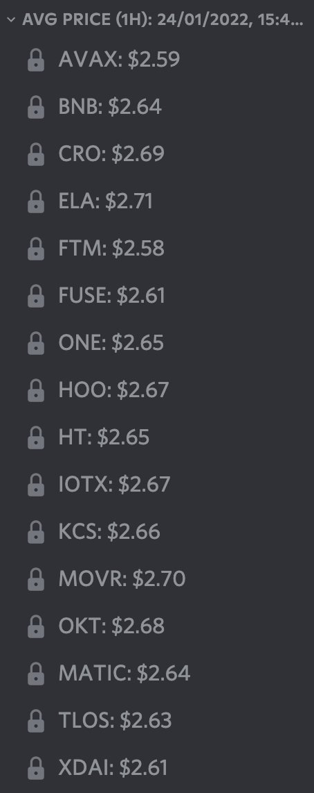

# Une paire de jetons LP, de nombreuses options de farming

## Introduction

Apporter de la liquidité sur un DEX (**D**ecentralized **EX**change) et récolter des récompenses est l'une des façons les plus courantes de cultiver des rendements dans la DeFi (**De**centralized **Fi**nance). Cependant, de nombreux utilisateurs ne font attention qu'aux taux de la pool de LP (**L**iquidity **P**roviding) dans laquelle ils entrent, sans vraiment vérifier si le taux est un APR (**A**nnual **P**ercentage **R**eward) ou un APY (**A**nnual **P**ercentage **Y**ield). Il existe de nombreuses façons de cultiver une pool de liquidités et de gérer les jetons de récompense. Nous allons voir dans ce guide quelques-unes des différentes options de farming sur l'une des dernières pools sur Harmony, MAI-ELK, et voir ce que vous pouvez faire avec les jetons ELK que vous obtiendrez en récompense.


Ce guide n'est en aucun cas un conseil financier, il a été réalisé dans un but éducatif. Vous devez faire attention aux variations de prix, à l'offre et à la demande, aux programmes de récompense, aux dates de fin, à l'Impermanent Loss (pertes non permanentes), etc... Le but n'était pas de proposer des stratégies à suivre aveuglément, alors faites vos devoirs et votre propre simulation, et n'investissez que ce que vous êtes prêt à perdre.


## Elk Finance

[Elk Finance](https://app.elk.finance/#/) est un DEX forké d'Uniswap v2, ainsi qu'un marché automatisé, AMM (Automoated Market Maker). Vous trouverez toutes les fonctionnalités habituelles d'Uniswap : échanger vos actifs, combiner vos différentes cryptomonnaies en jetons LP, farming de certaines paires LP, et le staking de leur jeton natif, le ELK.\
Ce qui fait d'Elk Finance un projet totalement différent, c'est sa présence sur de nombreuses blockchains, et pas seulement sur les chaînes compatibles EVM (**E**thereum **V**irtual **M**achine). En effet, Elk Finance est actuellement présent sur 16 chaînes et prévoit de s'étendre à beaucoup d'autres. Ils ont réussi à construire un bridge (pont) entre toutes ces chaînes pour permettre aux utilisateurs de transférer le jeton ELK : L'ElkNet.

Par ailleurs, une fonctionnalité intéressante proposée par ElkNet est la possibilité d'échanger une partie de l'actif transféré contre le jeton natif de destination. Cela est particulièrement utile si vous vous rendez pour la première fois sur une blockchain où il n'y a pas de faucet disponible.


À l'exception des chaînes où le gaz est élevé (uniquement Avalanche et Cronos à l'heure où nous écrivons ces lignes), l'utilisation d'ElkNet pour transférer vos jetons ELK d'une chaîne à l'autre se fait sans frais. Vous avez bien lu, vous ne payez aucun frais de transfert !


Enfin, Elk Finance offre une protection contre l'Impermanent Loss. Vous pouvez lire tous les détails du programme d'Impermanent Loss dans [leur documentation officielle](https://docs.elk.finance/features/impermanent-loss-protection), mais fondamentalement, tout ce que vous devez savoir, c'est que si le prix de l'ELK change entre le moment où vous déposez et le moment où vous retirez, vous serez payé avec de l'ELK supplémentaire afin de couvrir la perte non permanente. Étant donné que le MAI est indexé au dollar, la perte non permanente n'est liée qu'à l'évolution du prix de l'ELK, de sorte que vous êtes toujours gagnant lorsque vous entrez dans des pools de liquidités sur Elk Finance.

## Farming de la paire de jetons LP MAI-ELK

Elk Finance s'est associé à Mai Finance en janvier 2022 pour proposer du farming en utilisant la paire de LP MAI-ELK sur leur DEX. La paire MAI-ELK peut être utilisée sur 3 réseaux différents pour le moment : Harmony, Moonriver et Gnosis. D'autres pools de liquidités pourraient être lancées ultérieurement sur Polygon, Cronos et Fantom. Voyons les différentes stratégies que vous pouvez appliquer pour cette nouvelle pool.


Nous proposons ce guide pour Harmony car les frais de gaz sont très peu chers, ce qui vous permet de composer vos récompenses manuellement de façon quotidienne. Cela en fait une très bonne blockchain pour les débutants qui n'ont que quelques dollars à investir pour s'amuser. Cependant, tout ce qui est présenté dans ce guide peut également être appliqué à n'importe quelle autre blockchain.


### Farming et Staking

La toute première stratégie est assez simple :

* combinez vos jetons en paire LP
* déposez les jetons LP dans la pool MAI-ELK et obtenez un APR de 200%
* récoltez vos récompenses quotidiennement
* stakez les pour un APR de 32,53%

Si vous commencez avec un montant initial de 100 dollars, voici les résultats que vous pouvez obtenir mois après mois pour une année complète de farming, en supposant que les taux indiqués ci-dessus restent les mêmes pendant toute la période de farming.

| jour | MAI-ELK ($) | ELK staké ($) |
| ---- | ----------- | ------------- |
| 30   | 100.000     | 16.653        |
| 60   | 100.000     | 33.756        |
| 90   | 100.000     | 51.323        |
| 120  | 100.000     | 69.366        |
| 150  | 100.000     | 87.897        |
| 180  | 100.000     | 106.930       |
| 210  | 100.000     | 126.479       |
| 240  | 100.000     | 146.557       |
| 270  | 100.000     | 167.180       |
| 300  | 100.000     | 188.360       |
| 330  | 100.000     | 210.115       |
| 360  | 100.000     | 232.458       |

À la fin de l'année, vous auriez

* 100 dollars de jetons LP MAI-ELK dans la pool
* 236,24 dollars de jetons ELK stakés

Ce qui correspond à un APY global de 236,24%. Ce n'est pas exactement l'APR car une partie de la récompense est composée (les ELK stakés).


Vous pouvez trouver tous les résultats et la formule utilisée pour construire ce tableau dans le premier onglet de [la feuille de calcul Google suivante](https://docs.google.com/spreadsheets/d/1Vva5dhjYix0g4bMZRSAMIutDgbT08TsTLhVJE0TUrF8/edit?usp=sharing). Vous pouvez copier ce fichier sur votre propre disque et ajuster les taux et l'investissement initial pour voir l'APY changer en fonction du nombre que vous entrez.


### Farming et composer directement

Composer signifie que vous récoltez vos récompenses et que vous les utilisez pour créer des jetons LP supplémentaires. Dans notre cas, vous feriez :

* récolter vos ELK en récompense
* vendre 50% pour du MAI
* combiner en jetons LP MAI-ELK supplémentaires
* déposer dans la pool

Si vous commencez avec le même investissement initial de 100 dollars, les résultats que vous pouvez attendre pour une année complète de farming, en supposant que les taux donnés restent les mêmes pendant toute la période de farming, sont les suivants :

| jour | MAI-ELK ($) |
| ---- | ----------- |
| 30   | 117.172     |
| 60   | 138.044     |
| 90   | 162.635     |
| 120  | 191.607     |
| 150  | 225.739     |
| 180  | 265.952     |
| 210  | 313.328     |
| 240  | 369.143     |
| 270  | 434.901     |
| 300  | 512.374     |
| 330  | 603.647     |
| 360  | 711.179     |

Et à la fin de l'année, vous auriez&#x20;

* 730,878 dollars de jetons LP MAI-ELK dans la pool

Ce qui correspond, pour un investissement initial de 100 dollars, à un APY global de 630,88%. Comme nous composons les récompenses, il s'agit de l'APY exact que vous obtiendriez avec un APR de 200%.

À titre d'information, les formules permettant de calculer l'APY à partir d'un APR avec intérêts composés quotidiens (ou un APR à partir d'un APY) sont les suivantes :

$$
APY = ( 1 + \frac{APR}{N})^N-1
$$

$$
APR = N * (( 1 + APY)^\frac{1}{N} - 1)
$$

Avec `N` étant le nombre de fois que vous composez vos récompenses. Dans notre cas, les 2 formules nous donneraient :

$$
APY = ( 1 + \frac{2}{365})^{365}-1 = 634.88\%
$$

$$
APR = 365 * (( 1 + 6.3488)^\frac{1}{365} - 1) = 199.99\%
$$

Il est facile de voir et de comprendre que si vous appliquez un APR de 200% (l'APR de la pool) à vos récompenses, vous obtiendrez de meilleurs rendements que si vous appliquez un APR de 32,53% (APR de staking). En ce sens, les intérêts composés sont bien meilleurs que le staking tant que l'APR de farming reste supérieur à l'APR de staking. Cela peut évidemment changer en fonction de la quantité de liquidités dans la pool.


Comme pour la section précédente, la simulation se trouve dans la même [feuille de calcul Google](https://docs.google.com/spreadsheets/d/1Vva5dhjYix0g4bMZRSAMIutDgbT08TsTLhVJE0TUrF8/edit?usp=sharing), sur le deuxième onglet.


### Farming et composer en utilisant Mai Finance

Si le staking et les intérêts composés donnent de bons rendements, les deux méthodes sont directement liées au prix du jeton ELK, de sorte que la valeur de votre investissement variera en fonction du prix du ELK. Nous avons déjà vu que composer offre de meilleures options que le staking. Nous allons maintenant voir comment vous pouvez tirer de la valeur de vos récompenses de farming et continuer à investir dans la même pool en utilisant Mai Finance. La routine quotidienne serait la suivante :

* Récoltez vos ELK en récompense.
* Vendez 66% de la récompense pour acheter un jeton blue chip accepté comme collatéral sur Mai Finance. Pour notre exemple, nous utiliserons le jeton ONE.
* Déposez les jetons ONE dans votre coffre sur Mai Finance.
* Empruntez des MAI supplémentaires à 200% du CDR (**C**ollateral to **D**ebt **R**atio), dont la valeur correspondra à vos jetons ELK restants.
* Combinez en jetons LP MAI-ELK supplémentaires.
* Déposez dans la pool.


Convertir vos jetons de récompense en ONE n'est peut-être pas le moyen le plus sûr de protéger vos actifs, l'une des meilleures façons de le faire est de les convertir en stablecoin. Cependant, les options de Mai Finance sur Harmony au moment de la rédaction de cet article sont assez limitées. Vous aurez peut-être de meilleures options à l'avenir (après janvier 2021), comme le staking de jetons LP Stake DAO en collatéral (voir notre [article dédié à Polygon](../polygon/the-elephant-and-the-otter.md) pour voir comment vous pouvez utiliser les jetons Stake DAO sur Mai Finance).


Si vous commencez avec le même investissement initial de 100 dollars, les résultats que vous pouvez espérer pour une année complète de farming, en supposant que les taux donnés restent les mêmes pendant toute la période de farming et que votre coffre n'est pas liquidé, sont les suivants :

| jour | MAI-ELK ($) | ONE ($) | Dette de MAI ($) |
| ---- | ----------- | ------- | ---------------- |
| 30   | 111.154     | 11.560  | 5.780            |
| 60   | 124.003     | 24.456  | 12.228           |
| 90   | 138.337     | 38.842  | 19.421           |
| 120  | 154.328     | 54.892  | 27.446           |
| 150  | 172.168     | 72.797  | 36.398           |
| 180  | 192.070     | 92.772  | 46.386           |
| 210  | 214.273     | 115.055 | 57.528           |
| 240  | 239.042     | 139.915 | 69.958           |
| 270  | 266.674     | 167.648 | 83.824           |
| 300  | 297.501     | 198.588 | 99.294           |
| 330  | 331.891     | 233.106 | 116.552          |
| 360  | 370.257     | 271.609 | 135.805          |

Et à la fin de l'année, vous auriez

* 377,069 dollars de jetons LP MAI-ELK dans la pool
* 278,446 dollars de jetons ONE dans votre coffre ONE
* 139,223 dollars de dette de votre coffre
* un CDR de 200%, comme prévu

En partant d'une position initiale de 100 dollars de MAI-ELK, cela représenterait APY global de 416,29%. Ici, nous obtenons un peu moins de gains par rapport à de purs intérêts composés, mais nous avons également extrait une bonne partie de nos gains dans ONE, qui peut être moins volatile que ELK, et donc présenter moins de risques.


Une fois encore, la simulation se trouve dans la même [feuille de calcul Google](https://docs.google.com/spreadsheets/d/1Vva5dhjYix0g4bMZRSAMIutDgbT08TsTLhVJE0TUrF8/edit?usp=sharing), sur le troisième onglet.


Vous pouvez également vendre toutes vos récompenses ELK contre des jetons acceptés sur Mai Finance, emprunter des MAI et en vendre une partie pour acheter des ELK supplémentaires afin d'augmenter votre position dans la pool MAI-ELK. En procédant ainsi, vous augmentez votre exposition à ONE, mais aussi votre dette. Vous vous retrouverez avec 270,715 dollars de MAI-ELK, 352,913 dollars de ONE et 171,457 dollars de dette pour un APY global de 342,17%.

## Influence de la fréquence à laquelle vous composez les récompenses

Que vous décidiez de staker vos récompenses ou de les composer, il est important de comprendre que votre récompense changera en fonction de la fréquence à laquelle vous effectuez votre routine de récolte + investissement. À titre de rappel, la formule qui lie l'APY et l'APR est la suivante :

$$
APY = ( 1 + \frac{APR}{N})^N-1
$$

Dans cette équation, `N` représente le nombre de fois où vous composez vos récompenses en un an. Ainsi, un APR de 200% comme ci-dessus vous donnerait l'APY suivant en fonction de la fréquence de composition :

| Fréquence de composition | APY équivalent |
| ------------------------ | -------------- |
| quotidienne              | 634.88 %       |
| deux fois par semaine    | 625.01 %       |
| hebdomadaire             | 611.71 %       |
| deux fois par mois       | 609.55 %       |
| mensuelle                | 535.86 %       |
| trimestrielle            | 406.25 %       |
| deux fois par an         | 300.00 %       |

Composer manuellement plus d'une fois par jour peut coûter cher, en fonction de la blockchain utilisée. Mais fondamentalement, il est clair que plus vous composez souvent, meilleure est la récompense. Cela explique aussi pourquoi les optimiseurs de rendement et les composeurs automatiques sont populaires. Gardez à l'esprit qu'en composant, vous ajoutez une pression de vente sur le jeton que vous farmez, ce qui aura un impact négatif sur le prix de ce jeton. Si c'est aussi le jeton que vous utilisez pour le farming (dans notre exemple ELK), vous pouvez être impacté par des pertes non permanentes, à moins que vous utilisiez Elk Finance DEX, qui vous protège de l'Impermanent Loss.

## Choisir la bonne pool de liquidités

La paire MAI-ELK a été déployée sur plusieurs chaînes, il est donc possible pour vous de déployer votre capital sur la chaîne qui offre les meilleurs taux.


La pool MAI-ELK pourrait également être déployée sur d'autres chaînes dans un avenir proche, peut-être sur Polygon, Cronos et Fantom. Ceci n'est pas garanti et il n'y a pas de deadline pour cela, donc restez à jour en vérifiant les différents serveurs Discord des deux projets, ou en les suivant sur Twitter.


Outre le taux de récompense sur chaque chaîne, vous devrez peut-être aussi prendre en compte le prix du jeton ELK sur chaque chaîne. En effet, si le prix est presque le même sur toutes les chaînes, la différence minime peut également être un facteur pour vous permettre de choisir la chaîne où vous souhaitez farmer le jeton ELK.

Comme vous pouvez le constater, la pool MAI-ELK sur Moonriver donne un meilleur taux de récompense, et le jeton ELK a également un prix plus élevé sur cette chaîne. Cela signifie qu'à l'heure où nous écrivons ces lignes, il peut être préférable de farmer la pool MAI-ELK sur Moonriver plutôt que sur Harmony ou Gnosis, surtout si vous prévoyez de vendre une partie des jetons récoltés. Notez que cela peut ne pas être vrai tout le temps, donc assurez-vous de bien choisir votre chaîne et de faire vos propres recherches avant de rejoindre une pool de liquidités. Enfin, il est fortement recommandé de lire la [documentation sur la protection contre l'IL](https://docs.elk.finance/features/impermanent-loss-protection) car l'assurance dépend fortement du nombre de jours pendant lesquels vos jetons LP sont déposés dans la pool.

Par ailleurs, comme le transfert d'ELK est gratuit, vous pouvez éventuellement passer d'une chaîne à l'autre afin de toujours bénéficier des meilleurs taux. Assurez-vous de comprendre qu'en faisant cela, vous influencerez également les taux de récompense de la pool que vous quittez et de celle que vous rejoignez (moins de liquidité augmentera l'APR, plus de liquidité le diminuera).

## Disclaimer

Ce guide a été rédigé dans le but d'illustrer les différentes manières d'obtenir des rendements en utilisant des jetons LP. Vous influencerez fortement vos gains avec la stratégie que vous choisirez, ainsi que votre exposition au risque. Bien entendu, toutes les notions abordées dans ce document sont également applicables à n'importe quelle paire de jetons LP, et il est fortement recommandé d'effectuer vos propres simulations avant de choisir une stratégie, une paire de jetons LP, une pool ou même un DEX.


N'oubliez pas qu'une stratégie qui fonctionne bien à un moment donné peut donner de mauvais résultats (ou vous faire perdre de l'argent) à un autre moment. Restez informé, surveillez les marchés, gardez un œil sur vos investissements et, comme toujours, faites vos propres recherches.

