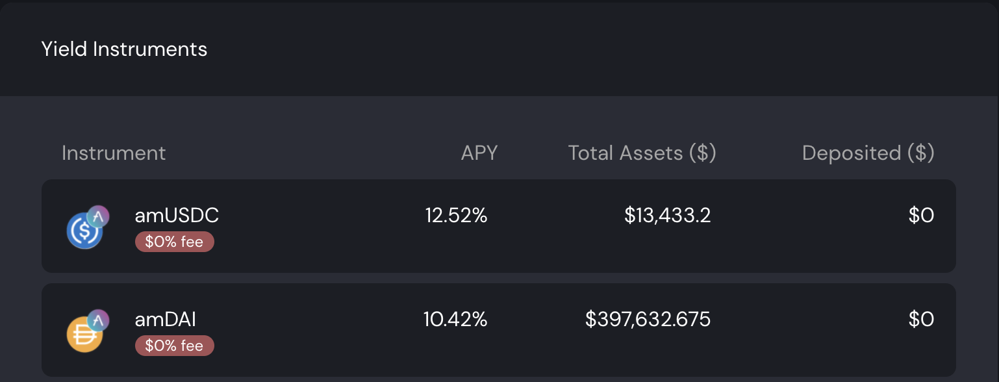
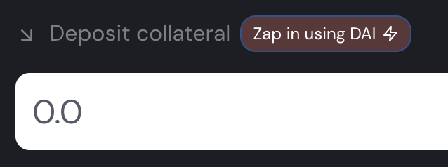

# camDAI pour les débutants

## Introduction

La plupart des gens peuvent avoir peur de se lancer dans la DeFi (**De**centralized **Fi**nance, ou finance décentralisée). Il y a toujours un facteur de risques à prendre en compte lorsque vous utilisez des crypto monnaies, et la volatilité du marché peut vous faire gagner beaucoup, mais aussi vous faire perdre beaucoup. De plus, les possibilités d'investissement sont tellement nombreuses que trouver la meilleure peut sembler être une quête insurmontable. Cependant, lorsque vous avez les bons outils, certaines stratégies présentant des risques maîtrisés peuvent proposer des résultats très compétitifs, et être aussi intéressants que des montages financiers plus complexes.

Dans ce guide, nous allons vous présenter une stratégie d'investissement basée sur le principe d'effet de levier appliqué à des monnaies stables, avec une pointe de risque afin d'augmenter un peu les résultats.

## Comprendre le principe d'effet de levier

Nous sommes dans le far west pendant la grande ruée vers l'or. Les banques veulent à tout prix acheter de l'or afin de pouvoir avoir assez de réserve et prêter de l'argent pour pouvoir récupérer des intérêts sur les emprunts. Les mineurs quant à eux veulent trouver le plus d'or possible pour le vendre aux banques et devenir riches.

Vous êtes un mineur d'or, mais pas très chanceux. Pour le moment, vous n'avez trouvé qu'une seule pépite. Cependant, vous êtes intelligent, alors plutôt que de continuer à miner, vous mettez un plan au point!

Vous vous rendez à la banque et expliquez que vous avez de l'or. Vous l'y déposez sans vendre votre pépite. Ainsi, la banque accroît son stock et peut prêter plus d'argent aux investisseurs. La banque va collecter des intérêts et en partagera une partie avec vous.

De plus, comme vous avez déposé de l'or à la banque, votre banquier vous permet d'emprunter de l'argent. Si jamais vous n'êtes pas capable de rembourser votre emprunt, la banque saisira votre or pour se rembourser. Vous voici donc dans une situation plutôt intéressante: vous avez votre or sécurisé à la banque, il vous rapporte des intérêts, et vous êtes en possession des quelques dollars.

Avec cet argent, vous décidez d'aller voir un de vos amis mineurs afin de lui acheter son or avec vos dollars. Cela lui permet de se concentrer sur son activité de minage tout en recevant de l'argent pour l'or qu'il trouve, et vous, vous avez plus d'or. Tout le monde est content.

Vous retournez donc à la banque et déposez votre nouveau magot. Comme vous avez maintenant plus d'or à la banque, vous collecterez également plus d'intérêts, et la banque vous permet également d'emprunter un peu plus d'argent puisque la valeur de votre or (collateral) est plus importante. Il est donc temps de retourner voir vos amis mineurs pour savoir s'ils ont plus d'or à vous vendre, et répéter la boucle encore et encore.

C'est ce principe qu'on appelle effet de levier. Maintenant imaginez qu'en plus de ça, la banque vous laisse emprunter avec un taux d'intérêt à 0% et sans calendrier de remboursement. Vous avez alors à votre disposition une machine qui va "fabriquer" beaucoup d'argent simplement à partir des intérêts de vos dépôts d'or.

## Présentation des outils

### AAVE

[AAVE](https://app.aave.com) est un protocol de prêts et d'emprunts. En déposant vos crypto monnaies sur AAVE, la plateforme les mettra à disposition des emprunteurs, et vous gagnerez des intérêts sur le montant mis à disposition. Pour notre stratégie, vous allez prêter des DAI, une monnaie stable (indexée sur la valeur du dollar américain). De manière générale, si vous déposez l'équivalent de 100$ sur AAVE, vous pouvez espérer un taux d'intérêt entre 4% et 10% annuels, le taux variant en fonction de l'utilisation (plus il y a d'emprunteurs, plus le taux est important).

Lorsque vous déposez vos monnaies sur AAVE, vous recevrez en échange un certificat de dépôt. Dans notre exemple, en déposant des DAI, vous recevrez des amDAI dans votre portefeuille (**a**ave **m**arket DAI). Ces jetons sont absolument nécessaires car ils vous permettront de retirer les DAI de AAVE plus tard. Sans eux vos fonds seront perdus. AAVE est la banque qui achètera votre or dans notre introduction.

### Mai Finance

[Mai Finance](https://app.mai.finance) est une autre plateforme de prêts et d'emprunts qui vous permettra de déposer certaines crypto monnaies dans un coffre personnel, et d'emprunter de la monnaie stable en fonction de votre dépôt. Si nous retournons à notre analogie du far west, ce serait une banque qui vous permettrait d'emprunter de l'argent, mais pas de l'argent qui aurait été prêté par d'autres utilisateurs. À la place, la banque imprime une nouvelle quantité d'argent correspondant à ce que vous retirez du marché en déposant votre or. De cette façon, vous n'empruntez que ce que vous avez enfermé dans votre coffre personnel.

Mai Finance va donc accepter les certificats amDAI sur sa page dédiée à la [composition d'intérêts](https://app.mai.finance/yield). Cet outil n'est qu'une étape entre AAVE et votre coffre personnel. Sur la capteur d'écran ci-dessus, vous pourrez noter qu'AAVE vous rapportera 8.75% d'intérêts annuels rajoutés à votre investissement original, mais également 2.01% de MATIC qu'il vous faudrait récolter manuellement sur AAVE. L'outil de composition d'intérêts de Mai Finance va collecter ces MATIC automatiquement et les vendre contre des DAI qui seront rajoutés à votre investissement initial. Ainsi, l'APY (**A**nnual **P**ercentage **Y**ield, ou pourcentage d'intérêts composés annuels) sur Mai Finance indique le taux d'intérêt global donné par AAVE.

Une fois que vous avez déposé vos amDAI dans l'outil de composition d'intérêts de Mai Finance, vous recevrez des camDAI en échange (**c**ompounding amDAI). Ces jetons sont encore une fois des reçus de dépôt qui indique votre part de la réserve de amDAI sur Mai Finance. A noter que ces jetons étant une preuve de dépôt, le ratio entre amDAI et camDAI n'est pas 1:1. Vous trouverez plus d'infos sur la différence entre les deux jetons dans [cet article](tirez-parti-aave-tokens.md#amtokens-vs-camtoken).

Vous pouvez à présent déposer vos camDAI dans un [coffre personnel](https://app.mai.finance/vaults) sur Mai Finance, et vous aurez alors la possibilité d'emprunter des MAI (une autre monnaie stable indexée sur 1$). Dans notre comparaison avec le far west, Mai Finance serait une seconde banque qui vous permettrait d'emprunter du cash en fonction du montant d'or que vous aurez déposé dans la première banque. Cette deuxième banque accepte votre preuve de dépôt comme garantie au cas où vous seriez incapable de rembourser votre emprunt.

### Zapper

[Zapper](https://zapper.fi/dashboard) est un peu comme un couteau suisse de la DeFi sur Polygon. Cette plateforme vous permet entre autre de gagner des intérêts en mettant à disposition vos liquidités, prêter vos cryptos sur AAVE directement depuis leur plateforme, échanger certaines crypto monnaies contre d'autres, présenter un récapitulatif de vos investissement sur une seule feuille de route etc. C'est l'option d'échange qui nous intéresse ici afin d'échanger nos MAI contre de nouveaux DAI.

Dans notre analogie avec le far west, Zapper est le mineur d'or qui nous permet d'échanger l'argent emprunté à la banque contre de l'or que vous allez y reposer.

### Balancer

Vous pourrez noter que dans la capture d'écran ci-dessus, Zapper utilise le protocole Balancer pour effectuer l'échange. [Balancer](https://polygon.balancer.fi/#/) est une plateforme mettant à disposition de la liquidité pour les échanges de cryptos où vous pourrez mettre à disposition certaines monnaies et collecter des intérêts sur les échanges.

Pour ce guide, nous utiliserons Balancer afin d'exposer nos gains à un peu plus de volatilité dans le but d'améliorer le gain final. Cependant, c'est une option non nécessaire.

## Description de la stratégie

### Strategie principale

Même si nous avons expliqué ce qu'est AAVE, notre stratégie va utiliser une fonctionnalité proposée par Mai Finance qui automatise le dépôt des DAI sur AAVE, le dépôt des amDAI dans l'outil d'optimisation de Mai Finance, et le dépôt des camDAI dans votre coffre personnel.

 

L'option `Zap in using DAI` ouvre une fenêtre modale qui vous permettra de déposer vos DAI dans votre coffre en utilisant AAVE en arrière-plan. C'est une option qui permet de sauver du temps et de l'argent (gas fees).

Ceci sera votre première étape. En partant du principe que vous avez 100$ de DAI, vous pouvez les déposer dans le coffre personnel camDAI, ce qui vous permettra d'emprunter des MAI.

Le CDR minimal (**C**ollateral to **D**ebt **R**atio, ou ratio entre la valeur de votre collatéral et celle de votre dette) pour le coffre camDAI est de 110%. Ceci veut dire que le ratio entre votre dépôt (les 100$ de DAI) et votre emprunt doit à tout moment rester au dessus de 110%.


Si le ratio atteint le seuil minimum de 110%, cela veut dire que votre dépôt perd de sa valeur et que votre dette peut possiblement devenir plus importante que la valeur de votre collatéral. À ce moment, votre coffre pourra être liquidé: un autre utilisateur peut rembourser une partie de votre dette et prendre une part de vos crypto monnaies déposées en collatéral en tant que compensation. Cependant, comme DAI et MAI sont toutes les deux des monnaies stables indexées sur le dollar US, le risque que votre dette dépasse la valeur de votre dépôt est très faible, ce qui rend cette stratégie relativement peu risquée.


Afin de conserver un risque de liquidation relativement faible, nous allons essayer de conserver un CDR de 115%. Pour connaître le montant que vous pouvez emprunter en conservant un CDR de 115%, nous utiliserons la formule suivante:

$$
MAI_{utilisables} = \frac{Collatéral_{valeur} - Detet_{valeur} * CDR_{cible}}{CDR_{cible}}
$$

Avec un dépôt initial de 100$ et aucune dette, si vous voulez conserver un CDR de 115%, voici combien de MAI vous pourrez emprunter:

$$
MAI_{utilisables}=\frac{100 - 0*1.15}{1.15}=86.95
$$

Ensuite, vous pourrez échanger vos MAI pour des DAI, et répéter la boucle. Dans le tableau suivant, vous pouvez avoir une idée de ce à quoi votre collatéral et votre dette ressembleront:

| Boucle # | Collatéral | Dette   | MAI utilisables | APY équivalent | Prix du DAI pour liquidation |
| -------- | ---------- | ------- | --------------- | -------------- | ---------------------------- |
| 1        | 100.000    | 0.000   | 86.956          | 10.42%         | 0                            |
| 2        | 189.956    | 86.956  | 75.614          | 19.48%         | 0.512                        |
| 3        | 262.571    | 162.571 | 62.751          | 27.36%         | 0.681                        |
| 4        | 328.323    | 228.323 | 57.175          | 34.21%         | 0.765                        |
| 5        | 385.498    | 285.498 | 49.718          | 40.17%         | 0.815                        |
| 6        | 435.216    | 335.216 | 43.233          | 45.35%         | 0.847                        |
| 7        | 478.449    | 278.448 | 37.593          | 49.85%         | 0.870                        |
| 8        | 516.042    | 416.042 | 32.690          | 53.77%         | 0.887                        |
| 9        | 548.732    | 448.732 | 28.426          | 57.18%         | 0.899                        |
| 10       | 577.158    | 477.158 | 24.718          | 60.14%         | 0.909                        |
| 11       | 601.877    | 501.877 | 21.494          | 62.72%         | 0.917                        |
| 12       | 623.371    | 523.371 | 18.691          | 64.96%         | 0.924                        |
| 13       | 642.062    | 542.062 | 16.253          | 66.90%         | 0.929                        |
| 14       | 658.315    | 558.315 | 14.133          | 68.60%         | 0.933                        |
| 15       | 672.448    | 572.448 | 12.289          | 70.07%         | 0.936                        |
| 16       | 684.737    | 584.737 | 10.686          | 71.35%         | 0.939                        |
| 17       | 695.423    | 595.423 | 9.293           | 72.46%         | 0.942                        |

Pour ce guide, nous nous arrêtons à 17 boucles mais vous pouvez parfaitement continuer.

A la fin de la 17ème boucle, vous aurez 695,423$ de collatéral et 595,423$ de dette. Ceci correspons à un CDR de 116,79%, ce qui devrait être suffisant pour éviter la liquidation.

Si l'on considère un APY de 10,42% attribué par AAVE via l'outil de composition d'intérêts de Mai Finance, cet investissement donnerait

$$
Intérêts = Collateral_{valeur}*APY=695.423*10.42\%= \$72.463
$$

Si l'on considère que l'investissement initial n'est que de 100$, l'APY équivalent est donc de 72,463% sur une simple position avec une monnaie stable et un risque maîtrisé!

### Strategie alternative

Afin d'introduire un peu de volatilité, nous allons maintenant voir comment utiliser la même stratégie mais en n'appliquant l'effet de levier seulement à 90% de votre emprunt. Les autres 10% seront utilisés pour acheter d'autres crypto monnaies plus volatiles. Dans notre exemple, nous allons utiliser 10% de nos MAI pour acheter des Qi (le token natif de la plateforme Mai Finance) et les déposer dans la réserve de liquidité Qi-BAL sur Balancer. Cette réserve a pour le moment un APR (**A**nnual **P**ercentage **R**evenue, ou pourcentage annuel d'intérêts non composés) de 107,12%.

Puisque vous allez réinjecter moins de DAI dans le coffre camDAI, vous allez également effectuer moins de boucles. Voici ce à quoi devrait ressembler votre investissement:

| Boucle # | Collatéral | Dette   | Qi     | Emprunt disponible | APY équivalent | Prix du DAI avant liquidation |
| -------- | ---------- | ------- | ------ | ------------------ | -------------- | ----------------------------- |
| 1        | 100.000    | 0.000   | 0.000  | 86.957             | 10.42%         | 0                             |
| 2        | 178.261    | 86.957  | 8.696  | 68.053             | 35.22%         | 0.537                         |
| 3        | 239.509    | 155.009 | 15.501 | 53.259             | 54.63%         | 0.712                         |
| 4        | 287.441    | 208.268 | 20.827 | 41.681             | 69.82%         | 0.797                         |
| 5        | 324.954    | 249.949 | 24.995 | 32.620             | 81.71%         | 0.846                         |
| 6        | 354.312    | 282.569 | 28.257 | 25.529             | 91.01%         | 0.877                         |
| 7        | 377.288    | 308.097 | 30.810 | 19.979             | 98.29%         | 0.898                         |
| 8        | 395.269    | 328.076 | 32.808 | 15.636             | 103.99%        | 0.913                         |
| 9        | 409.341    | 343.712 | 34.371 | 12.237             | 108.45%        | 0.924                         |
| 10       | 420.354    | 355.948 | 35.595 | 9.576              | 111.94%        | 0.931                         |

Ainsi, après 10 boucles vous aurez

* $420.354 de DAI en collatéral
* $355.948 de dette
* $35.595 de Qi

Le même calcul que dans la stratégie principale peut être utilisé ici aussi, ce qui donnerait

* Un CDR final de 118,09%, encore une fois une valeur qui devrait vous mettre à l'abris de la liquidation
* $43.800 d'intérêts sur vos DAI à partir du taux de 10.42% fourni par AAVE
* $68.139 d'intérêts sur vos Qi dans la réserve de liquidité de Balancer, si l'on assume que vous re-déposez vos gains en Qi et BAL dans cette même réserve
* Un APY final de 111,94%

Cette stratégie présente un peu plus de risques dans le sens où l'investissement dans la réserve de liquidité Qi-BAL n'est pas garanti. Cependant, vous aurez un peu d'exposition au Qi, ce qui vous permettra de participer aux votes pour améliorer le protocole QiDAO derrière Mai Finance. Vous pourrez aussi utiliser les récompenses en BAL sur Mai Finance puisque c'est une des cryptos acceptée en tant que collatéral, ce qui vous permettra d'emprunter d'autres MAI. Si vous faites ainsi, vous gagnerez également des Qi en fonction de la valeur de votre emprunt dans le coffre personnel BAL.

## Conclusion

Avec un investissement minimal et une gestion peu demandante, vous pourrez obtenir des résultats assez importants en appliquant un effet de levier sur vos DAI. Comme DAI est une monnaie stable qui a beaucoup de liquidité à travers plusieurs chaînes, le risque est relativement faible de voir la valeur du DAI s'éloigner de celle du dollar. C'est donc le genre de stratégie que vous pourrez mettre en place et laisser tourner sans trop y prêter attention, ce qui en fait un parfait premier pas dans le monde de la DeFi. Sans compter qu'il est fort probable que cette stratégie va vous permettre d'obtenir des gains quelque soit l'état du marché sans craindre la volatilité de certaines cryptos.

## Avertissement

Tout ce qui a été présenté dans ce tutoriel a été écrit dans un but purement éducatif afin d'illustrer une des options proposées par Mai Finance. Nous n'avons pas parlé de la façon de rembourser votre dette car il existe déjà des articles consacrés à ce sujet sur ce site. Gardez cependant à l'esprit que Mai Finance vous chargera des frais de 0.5% de votre dette lors du remboursement de cette dette. Comme toujours, veuillez faire vos propres recherches et n'hésitez pas à venir poser des questions sur le [serveur Discord de la communauté Qi DAO](https://discord.com/invite/qidaoprotocol).


Veuillez garder à l'esprit qu'une stratégie qui fonctionne bien à un moment donné peut parfaitement performer lamentablement (voir vous faire perdre de l'argent) dans d'autres circonstances. Restez informés, vérifiez les marchés, gardez un oeil sur vos investissements, et comme toujours, faites vos propres recherches.

