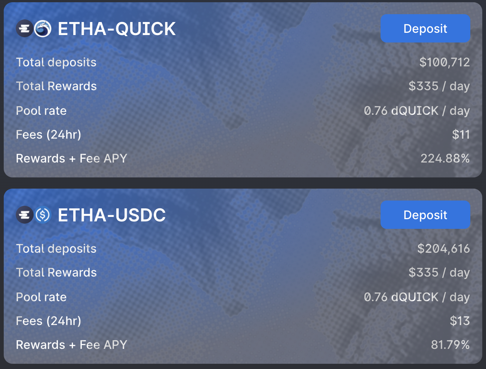

# MAI Staking simple avec Ethalend

## Introduction

L'une des missions de ce site et de la collection de tutoriels qui y sont proposés est de rendre la DEFI conviviale en démystifiant les protocoles les plus complexes. Cette vision est également partagée par l'équipe derrière [Ethalend] (<https://www.ethalend.org>), et ce guide présentera une façon simple d'utiliser cette plateforme en lien avec Mai Finance pour améliorer vos rendements de stable coin.

## Ethalend présentation

## Disclaimer

Tout ce qui est présenté dans ce tutoriel est un contenu éducatif destiné à illustrer comment vous pouvez utiliser vos MAI sans les vendre et générer un rendement annuel de plus de 60 % en utilisant différents protocoles comme des briques de lego. Cependant, ce tutoriel ne doit pas être considéré comme un conseil financier.

De plus, la stratégie présentée ici est une boucle fermée qui ne vend aucun jeton et chaque système alimente le suivant. Cependant, comme vous pouvez le constater, la position finale du dQUICK n'est pas très élevée, et le prêt MAI ne générera probablement pas beaucoup de Qi. Vous pouvez probablement obtenir le même rendement annuel équivalent (sinon meilleur) en vendant les récompenses QUICK accordées par le pool ETHA-QUICK, en achetant du MAI et en l'ajoutant à votre position MAI-USDT.


N'oubliez pas qu'une stratégie qui fonctionne bien à un moment donné peut donner de mauvais résultats (ou vous faire perdre de l'argent) à un autre moment. Restez informé, surveillez les marchés, gardez un œil sur vos investissements et, comme toujours, faites vos propres recherches.


## Comment fonctionne ETHALEND

Ethalend est un protocole qui abstrait la complexité de DeFi pour fournir un rendement optimal. Il ne s'agit pas d'un agrégateur de rendement, mais d'un optimiseur. Vous pourrez déposer vos actifs sur la plateforme, et l'algorithme en charge du pool dans lequel vous déposez vos actifs va  les investir de la meilleure façon possible. Les rendements sont ensuite distribués dans le token natif d'Ethalend, le token ETHA, ainsi que dans certains tokens partenaires, dont le Qi de Mai Finance que vous pouvez obtenir en déposant votre MAI dans le Vault MAI-USDT. Vous pouvez en savoir plus sur Ethalend via leur [documentation officielle] (<https://docs.ethalend.org>), ou en lisant cette excellente [interview du co-fondateur] (<https://ambcrypto.com/un-complicating-defi-an-interview-with-ethalend-co-founder-danny-b/>).

### Créer son porte feuille ethalend depuis son navigateur

L'un des aspects très intéressants d'Ethalend est que l'application utilise un portefeuille dédié sur la chaîne qui n'est pas lié à votre portefeuille classique. Cela peut être considéré comme

* un avantage puisque tout risque contractuel est limité à ce qui est exposé dans ce portefeuille privé. De plus, certaines interactions entre l'application Ethalend et le portefeuille privé sont directement incluses dans l'utilisation de la plateforme, ce qui peut vous faire économiser quelques frais de transaction. Par ailleurs, le porte-monnaie intelligent ETHA est privé, ce qui signifie que vous seul aurez accès au porte-monnaie, ce n'est pas comme un porte-monnaie centralisé contrôlant la part correspondant à votre porte-monnaie.
  
* C'est un inconvénient, car cela ajoute de la complexité dans votre routine, et le porte-monnaie intelligent ETHA n'est pas compatible avec les dispositifs physiques.

Ce sera à vous de décider si les avantages apportent suffisamment de valeur pour dépasser les inconvénients. Lorsque vous êtes prêt à créer votre portefeuille, cliquez simplement sur le bouton "Créer un portefeuille" dans le coin supérieur droit de votre écran.

## Explication de la stratégie

Cette stratégie est relativement sûre puisqu'elle utilise le farming de stable coin et des rendements supplémentaires seront fournis grâce à des actifs plus volatils provenant des récompenses de la position.

### MAI single staking et gains

L'un des grands avantages d'Ethalend, et l'une des caractéristiques clés qui permet la simplification de DeFi, est que vous n'avez pas besoin de fournir une paire LP (**L**iquidité **P**roviding) composée de 2 actifs avec un ratio de 1:1.
L'algorithme qui gère le pool (ou le eVault dans notre cas) le fera automatiquement pour vous. De même, une fois que vous aurez déposé vos actifs dans un eVault, ils seront automatiquement ré-acheminés vers le meilleur protocole qui maximisera votre rendement. Les jetons de récompense seront récoltés et convertis pour vous régulièrement.

Dépôt de 100 MAI dans le vault électronique MAI-USDT depuis notre portefeuille MetaMask](../../.gitbook/assets/Ethalend-4.png)

Comme vous pouvez le voir, les détails des récompenses sont affichés dans la partie droite de l'écran. Les récompenses ETHA ne sont pas affichées, mais vous obtenez une estimation des récompenses Qi associées à votre dépôt. Si vous faites défiler la page, vous aurez également une bonne compréhension de la stratégie sous-jacente qui utilise QuickSwap dans notre cas. Les récompenses QUICK seront converties en récompenses Qi. Les récompenses ETHA sont frappées par le protocole pour vous inciter à utiliser leur plateforme au lieu de QuickSwap.


Faites attention aux frais de retrait de 0,10 %. Au moment où j'écris ces lignes, avec un dépôt de 100 MAI, je devrai payer des frais de sortie de 0,1 MAI, ce qui correspond à peu près à 10 jours de farming dans le  vault . Assurez-vous de bien comprendre ce point avant d'investir quoi que ce soit.


### Staker des token ETHA : Ethalend ou QuickSwap

La principale récompense que vous obtiendrez en prêtant votre MAI sur Ethalend sera payée en ETHA, le jeton natif d'Ethalend. L'un des principaux avantages d'Ethalend est que vous pourrez mettre en jeu vos jetons ETHA directement sur la plateforme et augmenter vos rendements.

!Staking your ETHA on Ethalend directly](../../.gitbook/assets/Ethalend-5.png)

Comme vous pouvez le constater, la meilleure option est de déposer les ETHA que vous avez gagnés dans le pool ETHA-QUICK. En raison de la nature des 2 actifs (très volatils), la récompense est vraiment élevée. Vous pouvez éventuellement réduire l' IL en déposant vos ETHA dans le pool ETHA-USDT si vous préférez. Dans les deux cas, vous serez récompensé par des jetons QUICK. Et bien sûr, si vous êtes vraiment optimiste quant à l'ETHA, vous pouvez miser vos récompenses dans le pool ETHA pour obtenir de l'ETHA supplémentaire.

Les vaults de staking sur Ethaland sont en fait une fonctionnalité offerte par Ethalend. Lorsque vous déposez vos jetons dans le pool, l'algorithme d'équilibrage vendra quelques-uns des jetons déposés pour acheter l'autre côté de la paire LP, et utiliser cette paire dans QuickSwap. À titre d'information, vous pouvez tout à fait faire cela manuellement : réclamez vos jetons ETHA, retirez-les dans votre portefeuille web3, vendez-en 50% pour des jetons QUICK, créez quelques jetons LP et déposez-les dans le pool QuickSwap :


QuickSwap propose un taux annuel de 223,1% sur la paire ETHA-QUICK, tandis qu'Ethalend affiche un taux annuel de 116,73% sur la même paire. Ceci est dû à la différence entre l'APY (**A**nnual **P**ercentage **Y**ield, ou récompenses autocompoundées) et l'APR (**A**nnual **P**ercentage **R**evenue, ou récompenses sans autocompounding). Les deux pourcentages sont en fait exactement les mêmes, donc la plateforme que vous avez choisie pour utiliser vos jetons ETHA n'a pas d'importance.


### Le vault dQUICK Mai

La meilleure façon d'utiliser les récompenses QUICK que vous obtiendrez en jalonnant vos ETHA est de les convertir en dQUICK. dQUICK peut être créé dans la Tanière du Dragon sur QuickSwap. C'est la façon dont QuickSwap incite les utilisateurs à miser leurs QUICK en les récompensant avec des QUICK supplémentaires : en verrouillant vos jetons QUICK sur QuickSwap, vous gagnerez des jetons supplémentaires.

(../../.gitbook/assets/Ethalend-7.png) [Dragon's Lair APY sur QuickSwap à partir de novembre 2021] (../../.gitbook/assets/Ethalend-7.png)


Le rendement annuel de dQUICK varie beaucoup, entre 20 % et 40 %, en fonction de la quantité de jetons QUICK qui sont effectivement mis en jeu sur la plate-forme.


Mais l'une des meilleures choses à propos de dQUICK est qu'il s'agit d'un jeton de "preuve de dépôt" qui peut être utilisé sur Mai Finance comme garantie. Cela signifie que, après avoir déposé vos récompenses QUICK d'Ethalend sur QuickSwap et reçu des dQUICK, vous pouvez vous rendre sur Mai Finance et déposer les jetons dQUICK dans un vault dQUICK pour emprunter des MAI contre eux.

[vault dQUICK sur Mai Finance à partir de novembre 2021](../../.gitbook/assets/Ethalend-8.png)

Quelques informations sur les vaults dQUICK :

* Ils ont un ratio de liquidation de 130 %, ce qui signifie que vous pourrez emprunter beaucoup de MAI contre vos jetons dQUICK. Toutefois, si vous souhaitez également percevoir des récompenses d'emprunt, vous devrez maintenir un CDR (**Ratio C**garantie/dette **D**) entre 155 % et 400 %. C'est une bonne idée, car le jeton QUICK est assez volatile, et en règle générale, ce site Web encourage fortement un CDR supérieur de 100 % au ratio de liquidation (ou 230 % pour dQUICK).
* Les vaults-forts dQUICK sont parmi ceux qui présentent le TAEG le plus élevé lorsque vous empruntez des MAI contre des dQUICK. Au moment de la rédaction du présent document, vous pouvez obtenir un TAEG de 39,40 % payé en jetons Qi en fonction du montant de MAI que vous emprunterez contre votre MAI.

Vous pouvez déjà voir que fournir du dQUICK est très intéressant puisque vous aurez un actif qui obtiendra des récompenses QUICK composées de QuickSwap, vous obtiendrez des récompenses Qi pour votre prêt, et vous monnayerez des MAI qui pourront ensuite être ajoutés à l'eVault sur Ethalend, augmentant votre position d'agriculture stable.

### Que faire de vos récompenses en Qi ?

Ce sujet est expliqué dans [un article dédié] (what-to-do-with-qi-on-polygon.md). Pour les besoins de ce tutoriel, nous nous contenterons de déposer vos Qi dans le pool Qi-BAL sur Balancer pour bénéficier d'un solide rendement, payé en Qi supplémentaires et en jetons BAL que vous pourrez composer dans exactement le même pool.

## Amorçage du système

Ce qui suit est une simulation réalisée avec un investissement initial de 100 $ de MAI que vous pouvez soit emprunter à un vault existant, soit acheter sur une plateforme DEX. Elle suppose que tous les TAP et les CAA actuels restent les mêmes sur une période d'un an, et que tous les jetons gardent le même prix, ce qui ne sera (bien sûr) jamais le cas.

### Premier jour

Le jour 1, vous déposerez votre MAI sur Ethalend dans le pool MAI-USDT, puis vous recevrez la récompense en Qi et ETHA à la fin de la journée.

| Type de récompense | Valeur en dollars |
| ------------------ | ----------------- |
| Mai on Ethalend    | 100.000           |
| Qi+BAL on Balancer | 0.032             |
| ETHA on Ethalend   | 0.070             |
| dQUICK on Mai      | 0.000             |
| debt on Mai        | 0.000             |

### Deuxième jour

Le deuxième jour, vous pouvez miser vos ETHA du premier jour sur Ethalend, ce qui générera des récompenses QUICK que vous pourrez ensuite convertir en dQUICK sur QuickSwap, déposer sur Mai Finance, et vous pourrez emprunter des MAI contre ces jetons. Vous pouvez également déposer vos Qi dans le pool Balancer. À la fin du deuxième jour, vous obtiendrez :

| Type de récompense  | Valeur en dollars |
| ------------------- | ----------------- |
| Mai sur Ethalend    | 100.000           |
| Qi+BAL sur Balancer | 0.065             |
| ETHA sur Ethalend   | 0.141             |
| dQUICK sur Mai      | 0.000             |
| Dette sur Mai 0.000 |

À partir de là, le système est mis en place, et vous serez en mesure de faire croître votre position stable de MAI, ainsi que d'obtenir des récompenses en Qi, BAL, ETHA et dQUICK. Notez que certaines valeurs sont trop faibles pour être significatives à ce stade, et puisque vous ne pourrez pas emprunter moins de 0,01 MAI, vous devrez accumuler dQUICK pendant 14 jours avant de pouvoir emprunter du MAI.

## Résultats  

### Routine quotidienne

La routine quotidienne d'agriculture est composée de

* Récolter les récompenses en Qi et ETHA du pool MAI-USDT sur Ethalend.
* Déposer les jetons Qi dans le pool Balancer sur Balancer.
* Déposer les jetons ETHA dans le pool ETHA-QUICK sur Ethalend.
* Récolter des récompenses QUICK dans le pool ETHA-QUICK sur Ethalend.
* Convertissez QUICK en dQUICK sur QuickSwap.
* Déposez du dQUICK dans le vault dQUICK sur Mai Finance.
* Emprunter des MAI dans le vault dQUICK sur Mai Finance.
* Déposer les MAI supplémentaires empruntés dans le pool MAI-USDT sur Ethalend.

En outre, vous serez en mesure de récolter et de composer les récompenses Qi et BAL chaque semaine.

### Résultats bruts mois après mois

Les résultats ci dessous sont donnés mois par mois

| day | Mai sur Ethalend | Qi sur Balancer | ETHA sur Ethalend | dQUICK sur Mai | MAI debt |
| --- | --------------- | -------------- | ---------------- | ------------- | -------- |
| 30  | 100.046         | 1.015          | 2.186            | 0.099         | 0.049    |
| 60  | 100.196         | 2.116          | 4.303            | 0.406         | 0.203    |
| 90  | 100.453         | 3.315          | 6.424            | 0.926         | 0.463    |
| 120 | 100.819         | 4.624          | 8.553            | 1.666         | 0.833    |
| 150 | 101.297         | 6.058          | 10.690           | 2.631         | 1.315    |
| 180 | 101.892         | 7.632          | 12.838           | 3.828         | 1.914    |
| 210 | 102.606         | 9.361          | 15.001           | 5.263         | 2.632    |
| 240 | 103.443         | 11.264         | 17.179           | 6.945         | 3.473    |
| 270 | 104.406         | 13.360         | 19.377           | 8.881         | 4.441    |
| 300 | 105.501         | 15.671         | 21.597           | 11.079        | 5.540    |
| 330 | 106.731         | 18.220         | 23.841           | 13.548        | 6.774    |
| 360 | 108.100         | 21.032         | 26.113           | 16.297        | 8.149    |
| 365 | 108.343         | 21.528         | 26.495           | 16.783        | 8.392    |

### Résultat à 365 jours

A la fin d'une année, vous auriez

* 108.343$ de MAI dans le pool MAI-USDT sur Ethalend.
* 26,495 $ d'ETHA dans le pool ETHA-QUICK sur Ethalend.
* 21,528 $ de Qi dans le pool Qi-BAL de Balancher.
* 16 783 $ de dQUICK dans le vault de dQUICK sur Mai Finance.
* 8,392 $ de dette MAI sur Mai Finance.

Cela représente 173,149 $ d'actifs et une dette de 8,392 $, ce qui correspond à un rendement annuel équivalent de 64,757 %. Ce résultat est obtenu avec un investissement initial de 100 $ de MAI et en utilisant un pool stable comme base d'exploitation. Notez que les frais de transaction n'ont pas été pris en compte, mais peuvent influencer le résultat final. Cela suppose également que vous réinvestissez vos gains quotidiennement pendant une année complète.
