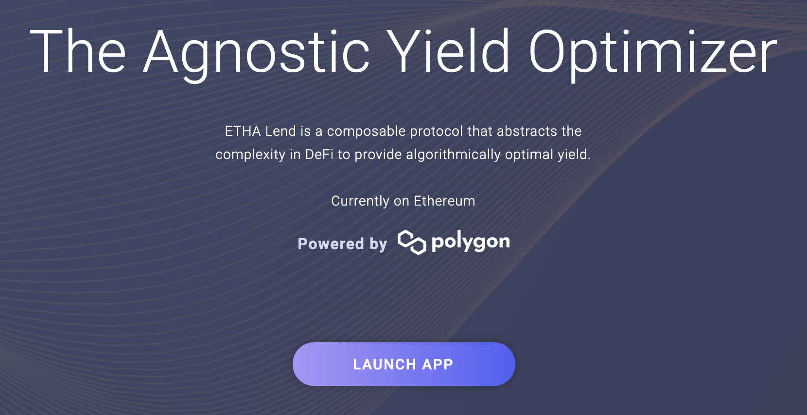

# TITRE

## Introduction

Expliquer la stratégie

## Protocole 

découverte du protocole

### Comment ça fonctionne 

Explication du chart

### Exemple d'utilisation 

bootstrap

#### Premier jour

| Type de récompense | Valeur en dollars |
| ------------------ | ---------------- |
| Mai on Ethalend    | 100.000          |
| Qi+BAL on Balancer | 0.032            |
| ETHA on Ethalend   | 0.070            |
| dQUICK on Mai      | 0.000            |
| debt on Mai        | 0.000            |

### Deuxième jour

Le deuxième jour / semaine 

| Type de récompense | Valeur en dollars |
| ------------------ | ---------------- |
| Mai sur Ethalend | 100.000 |
| Qi+BAL sur Balancer | 0.065 |
| ETHA sur Ethalend | 0.141 |
| dQUICK sur Mai | 0.000 |
| Dette sur Mai 0.000

 
## Résultats  

### Routine quotidienne

La routine quotidienne d'agriculture est composée de

* Récolter les récompenses en Qi et ETHA du pool MAI-USDT sur Ethalend.
* Déposer les jetons Qi dans le pool Balancer sur Balancer.
* Déposer les jetons ETHA dans le pool ETHA-QUICK sur Ethalend.
* Récolter des récompenses QUICK dans le pool ETHA-QUICK sur Ethalend.
* Convertissez QUICK en dQUICK sur QuickSwap.
* Déposez du dQUICK dans le coffre-fort dQUICK sur Mai Finance.
* Emprunter des MAI dans le coffre-fort dQUICK sur Mai Finance.
* Déposer les MAI supplémentaires empruntés dans le pool MAI-USDT sur Ethalend.

En outre, vous serez en mesure de récolter et de composer les récompenses Qi et BAL chaque semaine.

### Résultats bruts mois après mois

Les résultats ci dessous sont donnés mois par mois

| day | Mai on Ethalend | Qi on Balancer | ETHA on Ethalend | dQUICK on Mai | MAI debt |
| --- | --------------- | -------------- | ---------------- | ------------- | -------- |
| 30  | 100.046         | 1.015          | 2.186            | 0.099         | 0.049    |
| 60  | 100.196         | 2.116          | 4.303            | 0.406         | 0.203    |
| 90  | 100.453         | 3.315          | 6.424            | 0.926         | 0.463    |
| 120 | 100.819         | 4.624          | 8.553            | 1.666         | 0.833    |
| 150 | 101.297         | 6.058          | 10.690           | 2.631         | 1.315    |
| 180 | 101.892         | 7.632          | 12.838           | 3.828         | 1.914    |
| 210 | 102.606         | 9.361          | 15.001           | 5.263         | 2.632    |
| 240 | 103.443         | 11.264         | 17.179           | 6.945         | 3.473    |
| 270 | 104.406         | 13.360         | 19.377           | 8.881         | 4.441    |
| 300 | 105.501         | 15.671         | 21.597           | 11.079        | 5.540    |
| 330 | 106.731         | 18.220         | 23.841           | 13.548        | 6.774    |
| 360 | 108.100         | 21.032         | 26.113           | 16.297        | 8.149    |
| 365 | 108.343         | 21.528         | 26.495           | 16.783        | 8.392    |

### 365 jours - conclusion

A la fin d'une année, vous auriez

* 108.343$ de MAI dans le pool MAI-USDT sur Ethalend.
* 26,495 $ d'ETHA dans le pool ETHA-QUICK sur Ethalend.
* 21,528 $ de Qi dans le pool Qi-BAL de Balancher.
* 16 783 $ de dQUICK dans le coffre de dQUICK sur Mai Finance.
* 8,392 $ de dette MAI sur Mai Finance.

## Disclaimer

Tout ce qui est présenté dans ce tutoriel est un contenu éducatif destiné à illustrer comment vous pouvez utiliser vos MAI sans les vendre et générer un rendement annuel de plus de 60 % en utilisant différents protocoles comme des briques de lego. Cependant, ce tutoriel ne doit pas être considéré comme un conseil financier.


N'oubliez pas qu'une stratégie qui fonctionne bien à un moment donné peut donner de mauvais résultats (ou vous faire perdre de l'argent) à un autre moment. Restez informé, surveillez les marchés, gardez un œil sur vos investissements et, comme toujours, faites vos propres recherches.

