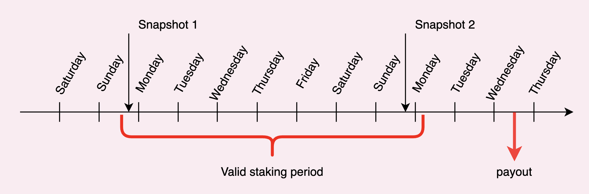

# Obtenez des gains passifs avec QiDAO

## Que sont les gains passifs sur Mai Finance?

Mai Finance redistribue une partie de ses gains hebdomadaires aux détenteurs de Qi. Pour être plus précis, les dividendes redistribués sont:

* 30% des frais de remboursements de dette (avec un bonus de 25%)
* 100% des gains obetnus en utilisant les frais de dépôts des fermes de liquidité de Mai Finance pour récolter des Qi
* 30% des frais d'échange prélevés sur l'ancre

Cette part de revenus est distribuée aux utilisateurs ayant bloqué (staking) leurs Qi pour une période de temps donnée, et est envoyée directement dans le portefeuille de ces utilisateurs. La distribution se fait chaque mercredi et vous pourrez à tout moment vérifier l'historique des paiements [ici](https://app.mai.finance/rewards).

## Introduction à la notion de snapshot

Un snapshot est simplement l'enregistrement de l'état dans lequel se trouve la blockchain à un moment donné (pour un bloc donné). Cet enregistrement va contenir l'intégralité des données de la chaîne, toutes ses adresses ainsi que leur état au moment du snapshot. Puisque Mai Finance effectue ses snapshots sur la chaîne Polygon, il est possible d'avoir une bonne estimation de la date du prochain snapshot en utilisant [Polygonscan](https://polygonscan.com).

Vous devenez éligible pour la distribution des dividendes si vous bloquez vos Qi pour un minimum de \~10 jours, dépendament du moment où vous bloquez vos Qi. En d'autres termes, une période de staking valide doit contenir un minimum de 2 snapshots pour pouvoir recevoir les récompenses le mercredi suivant le 2ème snapshot.

Ceci est un exemple du strict minimum pour une période de staking. Bien entendu, vous avez la possibilité de bloquer vos Qi pour une période plus longue, et il y a d'ailleurs des bénéfices à les bloquer le plus longtemps possible. Plus la période de staking est longue, plus le boost appliqué au rendement sera important.

## Comprendre le Qi boost et le Qi Powah

Maintenant que nous avons compris ce qu'était un snapshot, il est temps de commencer à gagner des revenus passifs. Pour cela, il suffit de se rendre sur [la page de boost](https://app.mai.finance/boost) sur Mai Finance.

### Que sont le Qi boost et le Qi powah?

Le Qi boost est l'opportunité d'accroître votre pouvoir lors des votes et vos gains de dividendes. Plus vous bloquez vos Qi longtemps, plus votre vote obtiendra de pondération (Qi Powah) et vos récompenses hebdomadaires seront également impactées. Vous pouvez obetnir un boost maximal de 4x en bloquand vos Qi pendant 4 ans. Avec le temps, votre boost va diminuer, jusqu'à libérer vos Qi lors de la fin de la période bloquée. S'il est impossible de réduire la durée de boost, il est toujours possible de l'augmenter jusqu'à un maximum de 4 ans. Vos Qo boostés sont représentés par des eQi (escrowed Qi) et resteront dans cet état jusqu'à leur expiration (ils ne seront pas transférables).

Ainsi, bloquer des Qi présente les avantages suivants:

* Vous pourrez commencer à recevoir des récompenses hebdomadaires simplement en bloquant vos jetons Qi
* En tant que DAO (**D**ecentralized **A**utonomous **O**rganization, ou organisation décentralisée autonome), votre voix sera prise en compte et pondérée en fonction du montant de Qi bloqués et de la durée de staking. Vous pouvez à tout moment consulter les votes passés et en cours sur [la page de vote](https://snapshot.org/#/qidao.eth).

### Bloquez vos Qi

Afin de bloquer vos jetons Qi, vous devez vous rendre sur la page de boost et sélectionner le nombre de jetons que vous souhaitez bloquer. Par défaut, ils seront bloqués seulement une semaine. Vous pourrez ensuite choisir d'augmenter la durée de staking. Plus vous bloquez vos Qi longtemps, plus vous obtiendrez d'eQi en échange.

Une fois que vous aurez choisir le montant et la période de blocage, il vous suffit d'approuver la transaction.


Veillez à bien comprendre qu'une fois vos Qi bloqués pour une période donnée, il est formellement impossible de les débloquer avant que la période de staking ne soit révolue. Il est donc important d'utiliser cette fonctionnalité en conscience de cause.


Félicitations, vous êtes maintenant un staker de Qi et vous recevrez votre part des dividendes sous peu. Si vous avez des doutes pour savoir si vous êtes qualifié pour les dividendes de la semaine en cours, vous pouvez toujours vous référer à la page de boost qui vous l'indiquera.

.JPG>)

### Statistoques des dividendes

Si par hasard vous souhaitez avoir un apperçu de l'historique des dividendes, c'est possible de l'obtenir sur [la page des statistiques](https://app.mai.finance/boost/stats) qui vous indiquera combien de Qi sont bloqués, la durée moyenne de staking, ainsi que les revenus de la plateforme pour les semaines précédantes.

## FAQ sur le staking

* **Quand faut-il que le bloque mes Qi?**

Les snapshots sont effectués la plupart du temps le samedi ou le dimanche, et ils enregistrent qui a des Qi bloqués pour un minimum de 1 semaine à partir du moment du snapshot. Si c'est votre cas, vous serez qualifié pour obtenir une part des revenus de la plateforme la semaine suivante.

* **Où puis-je voir quand aura lieu le prochain snapshot?**

Si vous vous rendez sur la page de boost, vous pouvez copier l'index du bloc dans "Next blocks" et le coller dans Polygonscan. Vous obtiendrez alors une estimation de l'heure du prochain snapshot.

* **Combien de temps faut-il bloquer mes Qi?**

Au moment du snapshot, il faut que les Qi soient bloqués pendant au moins 1 semaine complète. Si vous souhaitez être certain d'être éligible, il est recommandé des bloquer vos Qi pour un minimum de 2 semaines ou plus.

* **Quand est-ce que je vais recevoir mes récompenses?**

Chaque mercredi, ils seront déposés directement dans votre portefeuille, ou pourront être possiblement collectés sur la page des récompenses dans une prochaine version de la plateforme. Il se peut que l'heure exacte fluctue quelque peu, veuillez s'il vous plaît être patients puisque l'équipe doit vérifier les montants distribués avant de les envoyer.

* **Mais j'ai bloqué des Qi il y a 2 semaines et je n'ai toujours rien reçu!**

Il y quelques explications possibles: soit tout est correct mais il vous faut cependant attendre jusqu'au mercredi suivant, ou lors du snapshot vos Qi n'étaient pas bloqués jusqu'au snapshot suivant. Globalement, les récompenses sont envoyées environ 10 jours après chaque snapshot si vous êtes qualifié.

* **Quels sont les jetons que je vais recevoir?**

Toutes les récompenses sont distribuées sous forme de Qi.

* **D'où viennent les dividendes?**
  * 100% des gains de farming obtenus grâce aux frais de dépôt (2 245 681$ utilisés pour farmer à date de la 14ème semaine du protocole)
  * 30% des frais de remboursement de dette (18 362$ en moyenne hebdomadaire)
  * 30% des frais d'utilisation de l'ancre (178 365$ en moyenne hebdomadaire)
* **Que les sont eQi et que puis-je faire avec?**

Les eQi (escrowed Qi) représentent le bonus de boost appliqué sur vos votes ainsi que sur les récompenses de staking. Dans ces 2 cas, 1 Qi = 1 eQi.

* **Mais attendez, j'ai bloqué mes Qi pour obtenir des dividendes. Qu'est-ce que les votes viennent faire dans l'histoire?**

QiDAO est un DAO, et le futur de l'organisation est décidé démocratiquement par l'ensemble de la communauté. En tant que détenteur de jetons Qi, vous avez la possibilité de voter sur les QIP (**Q**i **I**mprovement **P**roposals) publiés sur la page de gouvernance.

* **Quel genre de rendement puis-je espérer avec mes Qi bloqués?**

Chaque semaine est différente puisque les dividendes distribués dépendent des revenus que le protocole collect chaque semaine. Vous pouvez avoir une estimation de vos gains avec l'APY equivalent affiché sur la page de boost, le temps moyen de staking, et les statistiques hebdomadaires de la plateforme.

* **Puis-je rajouter des Qi à ceux qui sont déjà bloqués, ou puis-je modifier la durée de staking?**

Oui, il est possible de faire les deux depuis la page de boost. Il vous suffit de sélectionner le montant à ajouter, et/ou la durée à ajouter.

* **Puis-je bloquer différents montants de Qi pour des périodes de staking différentes?**

Ce n'est pas possible pour le moment à partir du même portefeuille. Cependant, vous pouvez facilement créer un 2ème portefeuille. Il vous sera alors possible de bloquer différents montants pour différentes périodes de temps.

* **Qu'arrive-t-il lorsque la période de staking arrive à échéance?**

Vous aurez la possibilité de retirer vos fonds et vous recevrez dans votre portefeuille le montant que vous aviez initialement déposé.

* **Mais j'ai bloqué mes Qi pour 4 ans et je vois 4 fois plus de eQi que de Qi!**

C'est normal. Les eQi vont graduellement réduire avec le temps, et à la fin de la période de staking, le ratio Qi / eQi sera redevenu 1. En attendant, vous pourrez bénéficier d'un boost sur vos dividendes et vos votes.

## Avertissement

Vosu pouvez trouver un article similaire sur le même sujet, [écrit par Genkham](https://medium.com/@GenKham/earning-passive-income-with-qi-dao-b92a6a3721bd).

Bien entendu, ce tutoriel n'est pas un conseil financier, il a été écrit dans un but éducatif. Le but n'est pas de vous fournir des recettes toutes prêtes, mais de vous présenter les différentes possibilités offertes par Mai Finance. Veuillez effectuer vos propres simulations et n'investissez que ce que vous seriez prêt à possiblement perdre.


Veuillez garder à l'esprit qu'une stratégie qui fonctionne bien à un moment donné peut parfaitement performer lamentablement (voir vous faire perdre de l'argent) dans d'autres circonstances. Restez informés, vérifiez les marchés, gardez un oeil sur vos investissements, et comme toujours, faites vos propres recherches.

