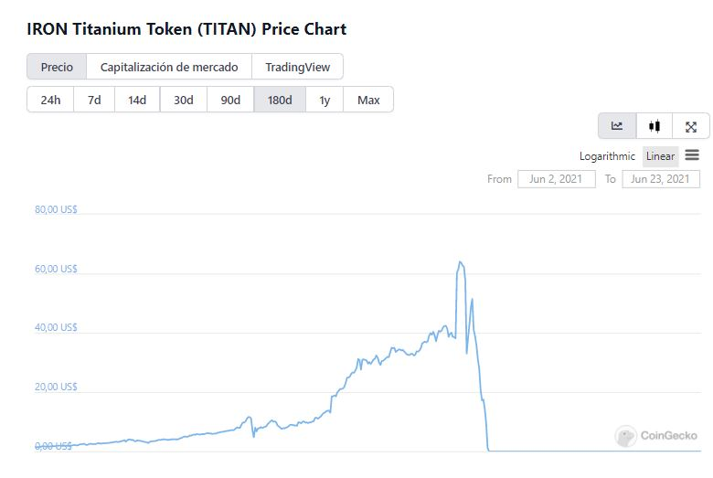
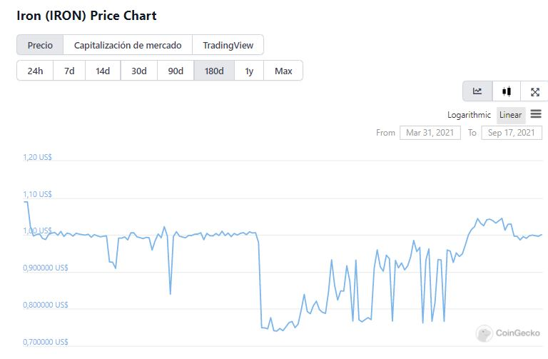

# Qu'est-ce que le MAI et comment fonctionne-t-il

## Qu'est-ce qu'une monnaie stable?

Avant de rentrer dans les détails concernant le MAI, il est important de se pencher sur la notion de monnaie stable, ou _stable coin_. Il s'agit d'un type de crypto monnaie qui est planifiée dans le but de conserver un prix stable sur le marché. La plupart des monnaies stables sont indexées (_pegged_ en anglais dans le texte) sur la valeur du dollar US, mais il existe également quelques monnaies stables qui sont indexées sur d'autres actifs comme l'or (c'est le cas de EGold) ou l'argent (c'est le cas de SilverCoin).

Cependant, toutes les monnaies stables ne sont pas créées et gérées de la même façon. On retrouve des monnaies stables partiellement collatéralisées ou entièrement collatéralisées. Les monnaies entièrement collatéralisées ont l'intégralité de leur valeur sur le marché soutenue par des actifs, alors que les monnaies partiellement collatéralisées vont utiliser des algorithmes complexes pour contrôler le montant de monnaie émis, et conserver une valeur fixe.

## Le fiasco de IRON Finance v1

Si vous étiez déjà dans la crypto au printemps 2021, vous avez peut-être entendu parler du fiasco des tokens **TITAN** et **IRON** de IRON Finance. Pour ceux qui souhaitent un bref récapitulatif, voici ce qui s'est passé. IRON Finance v1 était un projet avec 2 jetons:

* Le jeton **IRON**, une monnaie stable maintenue par un algorithme
* Le jeton natif **TITAN** propre à la plateforme IRON Finance

Le jeton IRON était une monnaie stable qui n'était pas entièrement collatéralisée par des actifs stables ou performants. Pour créer 1 IRON, il suffisait de 75% de USDC et 25% de TITAN, ce qui prouva être une excellente recette pour un désastre financier.

En juin 2021, le jeton TITAN a atteint la valeur de 65$. À ce point, plusieurs investisseurs ont décidé de revendre leurs jetons TITAN afin d'encaisser les bénéfices. Comme toute crypto monnaie, le prix du TITAN suit le marché de l'offre et de la demande. Si l'offre se met à exploser, le prix s'effondre. Et donc, alors que l'offre de jetons TITAN gonflait, le prix s'est mis à chuter, entraînant un effet de panique dans lequel tous les détenteurs de TITAN se sont mis à vendre leurs jetons afin de limiter leurs pertes. Le jeton IRON quant à lui s'est vu priver de 25% de son support et a donc perdu son ancrage au dollar américain.

Le jeton IRON ayant perdu 25% de sa valeur, plusieurs personnes se sont mises à en acheter puisque, en tant que monnaie stable, il était possible de les revendre pour 1 USDC et effectuer un gain d'arbitrage très facile. Ainsi, les pertes estimées se sont chiffrées quasiment à 1,75 milliards de dollars. Il est donc important de faire la distinction entre les différentes monnaies stables, car elles ne sont effectivement pas toutes identiques.

## Qu'est-ce que le MAI?

Le MAI est une monnaies stable qui est entièrement collatéralisée par des actifs vérouillés, et sa création est supportée en intégralité par ces actifs validés déposés dans les coffres sur Mai Finance, ou via l'ancre (mécanisme d'échange sur Mai Finance).

Il est également important de noter que la collatéralisation est toujours sur-évaluée. En effet, lorsque vous déposez vos actifs sur Mai Finance dans le but d'emprunter la monnaie stable MAI, vous aurez toujours à conserver un rapport Collatéral / Dette (**C**ollateral to **D**ebt **R**atio, ou CDR) supérieur à 100%, 135% en moyenne en fonction du type d'actif. Par exemple, si vous déposez pour 100$ d'actif, vous ne pourrez pas emprunter plus de 66,67$ de MAI si vous souhaitez conserver un CDR de 150%. Nous reviendrons sur cette notion un peu plus loin dans l'article.

L'autre façon de fabriquer des MAI est d'utiliser l'[ancre](https://app.mai.finance/anchor), un moyen mis en place afin d'échanger des MAI contre d'autres monnaies stables, principalement du USDC (et des USDT et DAI depuis Septembre 2021). Si vous déposez des USDC dans la trésorerie de Mai Finance, vous pourrez recevoir des MAI, et donc la monnaie stable créée est entièrement supportée par des USDC (dans ce processus). Si vous faites l'opération inverse, les USDC sont retirés de la trésorerie de Mai Finance et les MAI déposés sont détuits.

.png>)

Comme vous pouvez le remarquer sur le graphique ci-dessous, le prix du MAI est toujours proche de 1$. Ceci est expliqué plus en détails dans la [doc technique officielle](https://docs.mai.finance/stablecoin-economics), mais pour faire simple, la monnaie stable conserve sa valeur de 1$ grâce à l'opportunité d'arbitrage offerte par l'ancre, permettant à tout moment d'échanger des MAI contres des USDC à prix fixe, ce qui permet de conserver un valeur du MAI entre 0,99$ et 1,01$.

 (1) (1).png>)

## Pourquoi le prix reste-t-il proche de 1$?

L'indexation au dollar US est maintenue par 2 mécanismes. Nous allons approfondir ces mécanismes dans les sections suivantes.

### L'Ancre

L'ancre tient son nom des ancres de bateau: c'est un mécanisme qui permet au MAI de conserver une position stable quelque soit le courant du marché. Elle permet de créer des MAI ou d'en échanger contre d'autres monnaies stables. Vous pourrez remarquer sur la capture d'écran ci-dessous qu'il y a un frais fixe de 1% qui permet de:

* Le 1% de frais lors de la création de MAI définit le pallier haut du prix à 1,01$
* Le 1% de frais lors de la récupération de monnaie stable définit le pallier bas à 0,99$

.png>)

Avec un prix plafond et un prix plancher, le MAI ne peut pas diverger de son prix cible. En effet, grâce à l'ancre, il est possible de faire de l'arbitrage avec très peu de risques, c'est-à-dire qu'il est possible d'acheter des MAI quand son prix est sous 0,99$, ou en vendre quand il est au dessus de 1,01$.

Mais quand est-ce que le prix peut passer sous les 0,99$ ou au dessus de 1,01$? Comme pour toute monnaie stable, les fluctuations de prix sont liées au marché:

* Si le marché est plutôt dans une période frileuse (_bearish market_): Les utilisateurs vont vendre leurs actifs les plus volatiles afin d'éviter les pertes. Les actifs plus stables, y compris les monnaies stables, seront donc achetées comme valeur refuge, créant une forte demande et tirant le prix vers le haut.
* Si le marché est dans une forte frénésie acheteuse (_bullish market_): Les utilisateurs vont vendre leurs actifs stables pour pouvoir effectuer de forts gains sur des actifs beaucoup plus volatiles, ce qui va créer une forte offre de monnaies stables, tirant leurs prix vers le bas.

### Déposer des actifs comme collatéral dans votre coffre

Afin de créer des MAI en utilisant les coffres sur MAI finance, il vous faudra commencer par déposer des actifs comme collatéral dans votre coffre et conserver un CDR (**C**ollateral to **D**ebt **R**atio) au dessus d'un certain seuil appelé seuil de liquidation, et qui varie en fonction du type d'actif. Ceci implique que votre coffre sera **TOUJOURS** sur-collatéralisé et permet de supporter la valeur du MAI. Si la valeur de vos actifs dans votre coffre descend sous le seuil de liquidation, cela veut dire que votre dette risque alors d'avoir plus de valeur que vos actifs, ce qui poserait un soucis pour la valeur du MAI. A ce moment, d'autres utilisateurs pourront racheter une partie de votre dette et se payer avec une partie de vos actifs afin de rendre votre CDR à un niveau acceptable. C'est ce qu'on appelle une liquidation.

Si la valeur de vos actifs augmente, vous aurez l'occasion de créer des MAI supplémentaires puisque le ratio dette/collatéral augmente avec la valeur monnaitaire de votre coffre. L'inverse est également vrai, si la valeur de vos actifs chute, le CDR est réduit, et il vous faudra au choix repayer une partie de votre dette ou rajouter de nouveaux actifs afin d'éviter une liquidation lorsque votre coffre passe sous le seuil de liquidation.

## Conclusion

Vous aurez noté dans cet article que la monnaie stable MAI est une monnaie stable sur-collatéralisée, ce qui implique qu'il y aura à tout moment assez d'actifs pour supporter la valeur des MAI en circulation sur le marché. Cet aspect devrait soulager les utilisateurs un peu frileux à propos des projets proposant des monnaies stables telles qu'IRON Finance. Il est aussi bon de noter que plus il y aura de MAI sur le marché, plus le prix sera stable.

Depuis peu, les récompenses d'emprunts ont été mises en place, favorisant encore plus les emprunts sur Mai Finance et la création de MAI. Plus d'informations dans [l'article dédié](mai-loans-and-vault-incentives.md).

## Avertissement

Vous pourrez trouver un article expliquant le fonctionnement de MAI dans [la documentation officielle](https://docs.mai.finance/stablecoin-economics).

Bien entendu, ce guide est donné à titre purement éducatif et ne peut en aucun cas être considéré comme un conseil financier.


Veuillez garder à l'esprit qu'une stratégie qui fonctionne bien à un moment donné peut parfaitement performer lamentablement (voir vous faire perdre de l'argent) dans d'autres circonstances. Restez informés, vérifiez les marchés, gardez un oeil sur vos investissements, et comme toujours, faites vos propres recherches.

