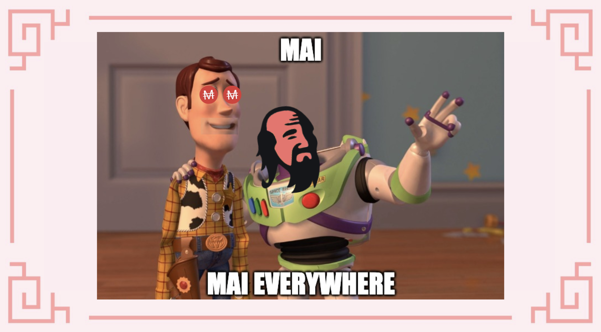

# MAI dans le Metaverse II

## Harmony ONE

### Qu'est-ce que Harmony ONE?

Harmony (ONE) est une plateforme blockchain décentralisée conçue comme un pont entre l'évolutivité et les efforts de décentralisation. Son développement s'est fait sous la devise de la "décentralisation à l'échelle", en mettant l'accent sur le partage des données et la création de places de marché de jetons fongibles et d'actifs non fongibles. En outre, Harmony promet de fournir un débit élevé accompagné de deux "bas" : la latence et les frais. Ensemble, ils sont censés placer la plateforme au cœur des efforts visant à jeter les bases des futures économies décentralisées et sans confiance.

Cependant, ce qui rend la blockchain Harmony unique, c'est son système de sharding. Le sharding "\*\*\*\*" est un synonyme de morceau ou de partie. Par sharding "\*\*\*\*", Harmony entend diviser ses nœuds en quatre groupes (shards) égaux. Ainsi, il y a 1 000 nœuds au total répartis en quatre shards, une shard étant composé de 250 nœuds. De plus, les nœuds exacts au sein des shards sont régulièrement et aléatoirement mélangés. Ce nombre est fixé exactement de manière à augmenter la sécurité du système et à accroître son évolutivité. Si vous souhaitez en savoir plus sur cette chaîne, vous pouvez lire cet [article](https://guarda.com/academy/crypto/what-is-harmony/).

### Obtenir du MAI sur Harmony

Pour envoyer du MAI de Polygon à Harmony, vous pouvez utiliser la plateforme [AnySwap](https://anyswap.exchange/#/router). L'interface utilisateur est assez simple, la seule chose que vous devez faire est de sélectionner la chaîne où vous avez du MAI et où vous voulez l'envoyer.&#x20;


Sachez qu'au bas de la page d'Anyswap, il y a des informations importantes sur le pontage de MAI, alors vérifiez-les avant d'effectuer toute transaction..


### Utiliser MAI sur Harmony

Actuellement, l'équipe de Mai Finance n'a pas de partenariat avec une ferme de rendement sur Harmony. Dès que l'équipe aura connaissance de projets qui utilisent MAI, cette documentation sera mise à jour. Restez à l'écoute.

## Moonriver

### Qu'est-ce que Moonriver?

Moonriver est la soeur de Moonbeam. Comme sa sœur, Moonriver est un environnement complet similaire à Ethereum et fonctionne avec les outils, DApps et protocoles Ethereum standard de l'industrie. La seule différence entre Moonriver et Moonbeam est la suivante:

* Moonriver est une parachaine contruite sur la chaine de relais Kusama.
* Moonbeam appartient à la chaine de relais Polkadot.

Moonriver est une route facile vers la chaîne relais de Kusama\*\*.\*\* Il permet aux équipes et aux développeurs ,qui sont familiers avec Ethereum, d'accéder au réseau Kusama avec peu ou pas de barrières. Il minimise les changements nécessaires pour exécuter les smart contracts Solidity existants sur le réseau. Par conséquent, les projets Ethereum peuvent simplement répliquer leur DApp et la déployer sur Moonriver à l'aide d'outils de déploiement populaires.

### Obtenir du MAI sur Moonriver

Pour envoyer du MAI à Moonriver, nous utiliserons la plateforme [Relaychain](https://app.relaychain.com/transfer#/cross-chain-bridge-transfer). Son interface utilisateur est très similaire à celle d'Anyswap. Lorsque vous souhaitez transférer des MAI depuis Polygon, vous devez d'abord connecter votre portefeuille MetaMask, puis sélectionner l'actif que vous souhaitez transférer (MAI) et le réseau de destination (Moonriver)..

### Utiliser MAI sur Moonriver

De la même manière que vous pouvez utiliser du MAI pour obtenir des rendements sur Polygon, vous pouvez utiliser du MAI sur Moonriver. L'endroit principal pour le  faire est [Solarbeam](https://app.solarbeam.io/farm). Au moment où nous écrivons ces lignes, la seule pool disponible qui utilise MAI est MOVR/MAI.


N'oubliez pas que pour utiliser cette ferme, vous devrez déposer le même ratio de MOVR et de MAI pour créer un jeton LP.


## Cronos

### Qu'estce que Cronos?

Cronos est une sidechain compatible EVM fonctionnant en parallèle avec la chaîne Crypto.org. Avant de lancer Cronos, l'écosystème Crypto.com comprend la chaîne Crypto.com et l'échange centralisé Crypto.com.

Cronos fonctionne sur un algorithme de consensus de preuve d'autorité (PoA) et est alimenté par Ethermint - une chaîne PoS interopérable avec Ethereum. Il vise à faire évoluer massivement l'écosystème Chain DeFi, en permettant aux développeurs de porter rapidement des applications et des smart contracts depuis Ethereum et d'autres chaînes compatibles EVM.

### Obtenir du MAI sur Cronos

Pour envoyer du MAI sur Cronos, nous allons utiliser la plateforme [Relaychain](https://app.relaychain.com/transfer#/cross-chain-bridge-transfer). Les étapes sont les mêmes que dans le cas de Moonriver, il suffit de sélectionner le réseau où vous envoyez le MAI (Polygon), le réseau où vous voulez le recevoir (Cronos) et l'actif que vous voulez envoyer (MAI).

### Utiliser MAI sur Cronos

Le principal endroit où vous pouvez obtenir des rendements sur Cronos en utilisant le MAI, c'est sur la plateforme [Crodex](https://swap.crodex.app/#/rewards/pair). Dans ce cas, il y a deux paires disponibles, la paire CRO-MAI et la paire MAI-USDC.

L'interface utilisateur de Crodex est très similaire à celle de Quickswap, mais n'oubliez pas que si vous voulez utiliser ces fermes, vous devrez déposer le même ratio de jetons pour créer un jeton LP. N'oubliez pas non plus d'avoir un peu de CRO en réserve pour payer les frais du réseau.

## Avertissements

Les détails présentés dans cet article sont purement éducatifs et n'ont pas été testés directement par l'équipe qui gère ces articles. Quelques utilisateurs sur le serveur Discord ont déjà essayé de relier leurs actifs à Moonriver et/ou Cronos, vous pouvez donc rejoindre la communauté Discord pour poser vos questions.&#x20;

N'oubliez pas de faire vos propres recherches, les différents réseaux ont des frais de transaction et des temps d'exécution différents, des programmes de récompense différents, des frais de pontage, etc... Si vous envoyez votre MAI à d'autres réseaux, assurez-vous de pouvoir les relier au cas où vous en auriez besoin sur Polygon.


N'oubliez pas qu'une stratégie qui fonctionne bien à un moment donné peut donner de mauvais résultats (ou vous faire perdre de l'argent) à un autre moment. Restez informé, surveillez les marchés, gardez un œil sur vos investissements et, comme toujours, faites vos propres recherches.

